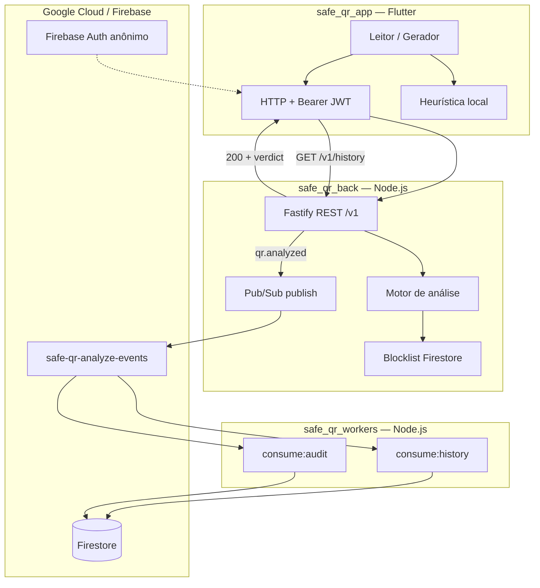

# Safe QR

**Analise antes de abrir** — ecossistema mobile para leitura segura de QR codes.

Projeto Interdisciplinar do 6º semestre — **DSM (Desenvolvimento de Software Multiplataforma)** · **FATEC Franca** · 2026/1  
**Grupo 09:** André Guerra e Vinicius Avila

Repositório: [github.com/FatecFranca/DSM-G09-PI6-2026-1](https://github.com/FatecFranca/DSM-G09-PI6-2026-1)

---

## O que é

O **Safe QR** ajuda usuários a **analisar QR codes antes de abrir o destino**. Em vez de abrir imediatamente um link, rede Wi-Fi ou outro payload, o sistema:

1. Lê o conteúdo (câmera ou geração manual)
2. Classifica o risco (`safe`, `suspicious`, `unsafe`, `unknown`)
3. Explica o veredito em português
4. Deixa o usuário decidir: abrir, copiar ou voltar

O monorepo reúne o app mobile, a API de análise e os consumidores assíncronos que persistem histórico e auditoria na nuvem.

---

## Arquitetura



| Modo | Comportamento |
|------|---------------|
| **Local** | Heurística roda no dispositivo; histórico em SQLite |
| **Remoto** | App chama `POST /v1/qr/analyze`; histórico via API + Firestore |
| **Assíncrono** | API publica evento Pub/Sub; workers gravam histórico e auditoria |

---

## Monorepo

| Pasta | Papel | Stack | Versão |
|-------|-------|-------|--------|
| [`safe_qr_app/`](./safe_qr_app/) | App mobile (leitor, gerador, histórico) | Flutter · Dart 3.11 | `1.0.0+1` |
| [`safe_qr_back/`](./safe_qr_back/) | API REST de análise e histórico | Node 20 · Fastify · TypeScript | `0.1.0` |
| [`safe_qr_workers/`](./safe_qr_workers/) | Consumidores Pub/Sub (histórico + auditoria) | Node 20 · TypeScript | `0.3.0` |

---

## Funcionalidades

### App (`safe_qr_app`)

- Leitura de QR pela câmera com análise automática
- Veredito visual com razões em português
- Gerador de QR (texto, URL, Wi-Fi, e-mail, telefone, SMS) com export PNG
- Histórico de leituras e QR gerados (local ou nuvem)
- Tema claro/escuro
- Identidade **Firebase Anonymous** + Bearer JWT nos pedidos remotos

### API (`safe_qr_back`)

- `GET /v1/health` — health check
- `POST /v1/qr/analyze` — análise heurística + blocklist opcional (Firestore)
- CRUD `/v1/history` — histórico na nuvem por usuário
- Publicação assíncrona `qr.analyzed` no Pub/Sub
- Logs estruturados com digest SHA-256 (sem armazenar URL completa nos logs)

### Workers (`safe_qr_workers`)

- `npm run consume:history` → `history/{idUser}/items/{id}`
- `npm run consume:audit` → `scan_events/{eventId}`
- Fan-out: um publish, duas subscriptions, dois destinos Firestore

---

## Stack tecnológica

| Camada | Tecnologias |
|--------|-------------|
| Mobile | Flutter, Provider, get_it, Dio, sqflite, mobile_scanner, Firebase Auth |
| API | Fastify, Zod, Pino, firebase-admin, @google-cloud/pubsub |
| Workers | @google-cloud/pubsub, firebase-admin, Zod, Pino |
| Nuvem | Firebase (Auth), Firestore, Google Cloud Pub/Sub |

---

## Pré-requisitos

| Ferramenta | Versão |
|------------|--------|
| Flutter SDK | ≥ 3.38.4 |
| Dart | ^3.11.4 |
| Node.js | ≥ 20 LTS |
| Android SDK | minSdk 24 |
| Conta GCP/Firebase | Projeto `safe-qr-app` (modo remoto + workers) |

---

## Início rápido

### 1. App — modo local (sem backend)

```bash
cd safe_qr_app
flutter pub get
cp assets/.env.example assets/.env
# ANALYZE_MODE=local
flutter run
```

### 2. App + API — modo remoto

**Terminal 1 — API:**

```bash
cd safe_qr_back
cp .env.example .env
npm install
npm run dev
```

**Terminal 2 — App:**

```bash
cd safe_qr_app
cp assets/.env.example assets/.env
# ANALYZE_MODE=remote
# API_BASE_URL=http://10.0.2.2:3000   # emulador Android
# API_BASE_URL=http://<IP-LAN>:3000  # dispositivo físico
flutter run
```

### 3. Produção — Cloud Run (stack completa, sem PC local)

| Serviço | Deploy |
|---------|--------|
| API | `cd safe_qr_back && .\scripts\deploy-cloud-run.ps1` |
| Workers | `cd safe_qr_workers && .\scripts\deploy-cloud-run.ps1` |

URLs e IAM: [`safe_qr_back/docs/deploy-cloud-run.md`](./safe_qr_back/docs/deploy-cloud-run.md) · [`safe_qr_workers/docs/deploy-cloud-run.md`](./safe_qr_workers/docs/deploy-cloud-run.md)

App (`safe_qr_app/assets/.env`):

```env
API_BASE_URL=https://safe-qr-api-214537528312.southamerica-east1.run.app
ANALYZE_MODE=remote
```

### 4. Stack local (histórico assíncrono em dev)

```bash
cd safe_qr_workers
cp .env.example .env
npm install
npm run consume:history   # terminal 1
npm run consume:audit     # terminal 2 (opcional)
```

> Não rode consumidores locais se os workers já estiverem no Cloud Run.

---

## Testes

```bash
# App
cd safe_qr_app && flutter test && flutter analyze

# API
cd safe_qr_back && npm test

# Workers
cd safe_qr_workers && npm test
```

---

## Documentação

### Por módulo

| Módulo | Índice |
|--------|--------|
| App | [`safe_qr_app/docs/README.md`](./safe_qr_app/docs/README.md) |
| API | [`safe_qr_back/docs/README.md`](./safe_qr_back/docs/README.md) |
| Workers | [`safe_qr_workers/README.md`](./safe_qr_workers/README.md) |

### Leitura recomendada

| Tema | Documento |
|------|-----------|
| Visão geral do app | [`safe_qr_app/docs/01-visao-geral.md`](./safe_qr_app/docs/01-visao-geral.md) |
| Arquitetura do app | [`safe_qr_app/docs/02-arquitetura.md`](./safe_qr_app/docs/02-arquitetura.md) |
| Integração mobile ↔ API | [`safe_qr_back/docs/10-integracao-mobile.md`](./safe_qr_back/docs/10-integracao-mobile.md) |
| Endpoints REST | [`safe_qr_back/docs/05-api-endpoints.md`](./safe_qr_back/docs/05-api-endpoints.md) |
| Histórico na nuvem | [`safe_qr_back/docs/12-api-historico.md`](./safe_qr_back/docs/12-api-historico.md) |
| Pub/Sub e fan-out | [`safe_qr_workers/docs/02-FANOUT-HISTORICO-AUDIT.md`](./safe_qr_workers/docs/02-FANOUT-HISTORICO-AUDIT.md) |
| Deploy Cloud Run | [`safe_qr_back/docs/deploy-cloud-run.md`](./safe_qr_back/docs/deploy-cloud-run.md) |
| Segurança e privacidade | [`safe_qr_app/docs/12-seguranca-privacidade.md`](./safe_qr_app/docs/12-seguranca-privacidade.md) |
| Firebase Anonymous | [`safe_qr_app/docs/17-identidade-firebase-anonymous.md`](./safe_qr_app/docs/17-identidade-firebase-anonymous.md) |
| Postman | [`safe_qr_back/docs/Safe-QR-API.postman_collection.json`](./safe_qr_back/docs/Safe-QR-API.postman_collection.json) |

---

## Segurança e secrets

**Não commitar:**

| Arquivo | Onde |
|---------|------|
| `assets/.env` | `safe_qr_app` |
| `.env` | `safe_qr_back`, `safe_qr_workers` |
| `credentials/*.json` | service accounts GCP |
| `*-firebase-adminsdk-*.json` | chaves admin Firebase |

**Podem ir ao git** (configs públicas do Firebase):

- `firebase.json`, `firebase_options.dart`, `google-services.json`

---

## Status do projeto

| Área | Estado |
|------|--------|
| Leitor com câmera real | ✅ |
| Análise local + remota | ✅ |
| Gerador com export PNG | ✅ |
| Histórico local (SQLite) | ✅ |
| Histórico remoto (API + Pub/Sub) | ✅ |
| Deploy Cloud Run (API + workers) | ✅ `southamerica-east1` |
| Blocklist Firestore (clones) | ✅ |
| Auditoria `scan_events` | ✅ |
| Publicação em lojas | ❌ fora do escopo |
| Motor ML / Safe Browsing | ❌ roadmap |

Roadmaps detalhados:

- App: [`safe_qr_app/docs/15-roadmap-gaps.md`](./safe_qr_app/docs/15-roadmap-gaps.md)
- API: [`safe_qr_back/docs/11-roadmap-evolucao.md`](./safe_qr_back/docs/11-roadmap-evolucao.md)

---

## Equipe

| Integrante | Papel |
|------------|-------|
| André Guerra | Desenvolvimento |
| Vinicius Avila | Desenvolvimento |

---

*Projeto acadêmico — FATEC Franca · DSM · PI6 · 2026/1*
