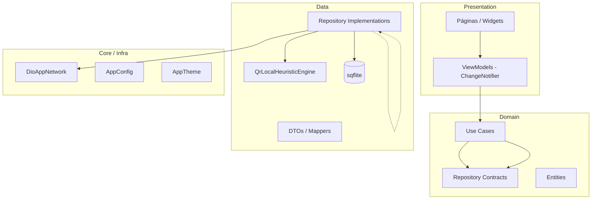
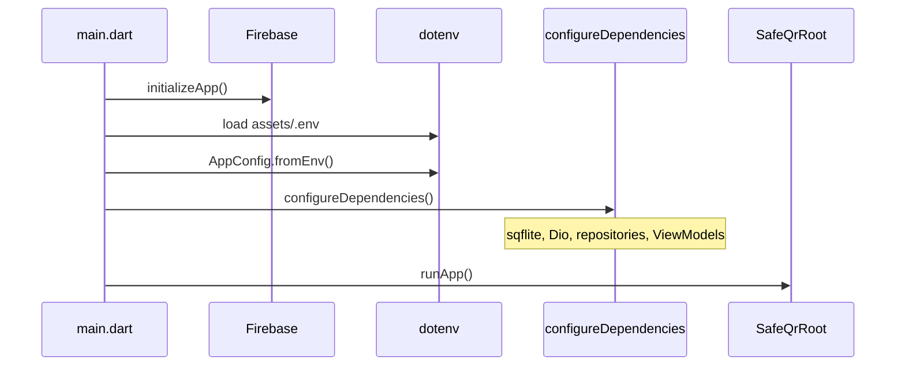
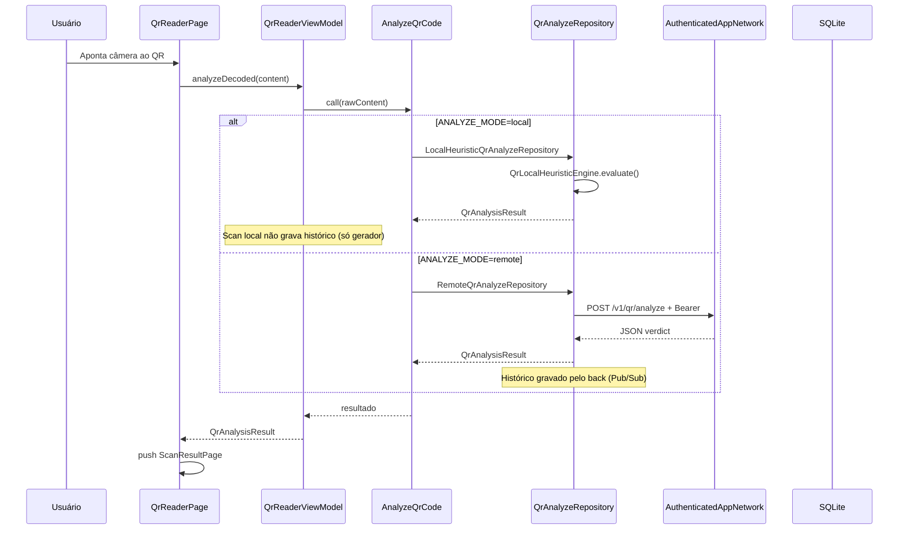

# 02 — Arquitetura

## Padrão arquitetural

O app segue **Clean Architecture orientada a features**, com três camadas por módulo:

```
presentation/  →  Páginas, ViewModels (ChangeNotifier), widgets
domain/        →  Entidades, contratos de repositório, casos de uso
data/          →  DTOs, mappers, implementações de repositório, engines locais
```

### Princípios

- **Separação de responsabilidades:** UI não conhece Dio nem SQLite diretamente
- **Inversão de dependência:** domínio define contratos; data implementa
- **Feature-first:** cada funcionalidade é autocontida em `lib/features/`
- **DI centralizada:** `get_it` registra dependências em `app/di/dependency_injection.dart`

## Visão em camadas



## Bootstrap da aplicação



**Arquivo de entrada:** `lib/main.dart`

1. `WidgetsFlutterBinding.ensureInitialized()`
2. `Firebase.initializeApp()`
3. `dotenv.load(fileName: 'assets/.env')`
4. `AppConfig.fromEnv()`
5. `configureDependencies()` — registra tudo no `GetIt`
6. `runApp(SafeQrRoot())`

## Fluxo de análise de QR (principal)



## Injeção de dependências

Registrado em `lib/app/di/dependency_injection.dart`:

| Tipo | Escopo | Implementação |
|------|--------|---------------|
| `AppConfig` | Singleton | Carregado do `.env` |
| `SharedPreferences` | Singleton | Preferências do SO |
| `AppThemeModeController` | Singleton | Tema persistido |
| `Database` | Singleton | `AppDatabaseBootstrapper` |
| `HistoryRepository` | Lazy singleton | `HistoryRepositoryImpl` (local) ou `RemoteHistoryRepository` (remote) |
| `QrAnalyzeRepository` | Lazy singleton | Local **ou** Remote (conforme `ANALYZE_MODE`) |
| `UserIdentityService` | Lazy singleton | UID + JWT para `AuthenticatedAppNetwork` |
| `Dio` / `AppNetwork` | Singleton / Lazy | `AuthenticatedAppNetwork` → `DioAppNetwork` |
| ViewModels | Lazy singleton | `QrReaderViewModel`, `QrGeneratorViewModel`, `QrHistoryViewModel` |
| Use cases | Lazy singleton | `AnalyzeQrCode`, `AddHistoryItem`, etc. |

### Seleção do motor de análise

```dart
if (cfg.analyzeMode == AnalyzeMode.local) {
  return const LocalHeuristicQrAnalyzeRepository(QrLocalHeuristicEngine());
}
return RemoteQrAnalyzeRepository(sl());
```

## Estado na UI

- **Provider** (`MultiProvider` em `SafeQrRoot`) expõe ViewModels e `AppThemeModeController`
- ViewModels estendem `ChangeNotifier` e chamam `notifyListeners()` após mudanças
- Páginas consomem via `context.watch<T>()` ou `context.read<T>()`

## Rede

Abstração `AppNetwork`:

- `AuthenticatedAppNetwork` — injeta Bearer JWT (`UserIdentityService`)
- `DioAppNetwork` — Dio, timeouts, erros (`AppHttpException` / `AppNetworkException`)
- GET/DELETE sem `Content-Type` (corpo vazio)
- Logs: `SafeQR.Net`, `SafeQR.Reader`, `SafeQR.History`, `SafeQR.Identity`

## Navegação

Navegação **imperativa** com `Navigator` + `MaterialPageRoute`. Sem `go_router` ou rotas nomeadas.

Ver detalhes em [09-navegacao-ui.md](./09-navegacao-ui.md).

## Integração com backend

O app consome a API em `safe_qr_back`. Em modo `remote`, o backend pode aplicar regras adicionais (ex.: blocklist Firestore de clones) que não existem no motor local.

Ver [07-api-integracao.md](./07-api-integracao.md).
