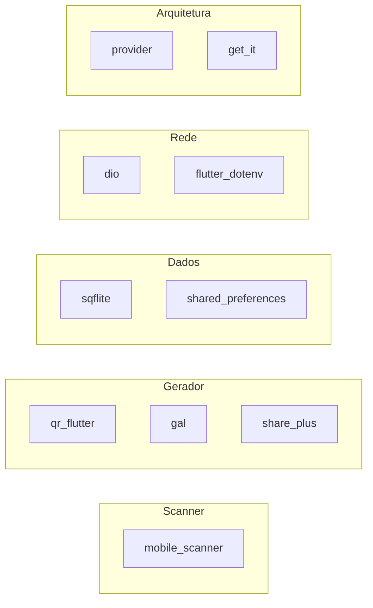

# 03 — Stack tecnológica

## Runtime

| Componente | Versão / requisito |
|------------|-------------------|
| **Flutter** | >= 3.38.4 (lockfile); doc acadêmico cita 3.41.x |
| **Dart SDK** | ^3.11.4 |
| **Versão do app** | 1.0.0+1 |

## Framework e UI

| Pacote | Versão | Uso |
|--------|--------|-----|
| `flutter` | SDK | Framework base |
| `cupertino_icons` | ^1.0.8 | Ícones iOS-style |
| `google_fonts` | ^6.2.0 | Plus Jakarta Sans, JetBrains Mono |
| Material 3 | nativo | Tema via `AppTheme` |

## Arquitetura e estado

| Pacote | Versão | Uso |
|--------|--------|-----|
| `provider` | ^6.1.2 | `ChangeNotifier` + `MultiProvider` |
| `get_it` | ^8.0.0 | Service locator / DI |
| `equatable` | ^2.0.5 | Comparação de entidades |

## Rede e configuração

| Pacote | Versão | Uso |
|--------|--------|-----|
| `dio` | ^5.7.0 | Cliente HTTP (via `DioAppNetwork`) |
| `flutter_dotenv` | ^5.2.1 | Carrega `assets/.env` |

## QR — leitura e geração

| Pacote | Versão | Uso |
|--------|--------|-----|
| `mobile_scanner` | ^7.0.0 | Leitura via câmera |
| `qr_flutter` | ^4.1.0 | Renderização do QR gerado |

## Persistência

| Pacote | Versão | Uso |
|--------|--------|-----|
| `sqflite` | ^2.4.0 | Histórico local (SQLite) |
| `shared_preferences` | ^2.3.3 | Preferência de tema |
| `path_provider` | ^2.1.4 | Diretório de documentos (DB) |
| `path` | ^1.9.0 | Join de caminhos |

## Utilitários

| Pacote | Versão | Uso |
|--------|--------|-----|
| `uuid` | ^4.5.0 | IDs de histórico e requestId local |
| `intl` | ^0.20.0 | Formatação de datas |
| `collection` | ^1.19.0 | Utilitários de coleção |
| `async` | ^2.13.0 | `unawaited` no bootstrap |

## Plataforma — ações nativas

| Pacote | Versão | Uso |
|--------|--------|-----|
| `url_launcher` | ^6.3.0 | Abrir URLs no navegador externo |
| `share_plus` | ^10.1.4 | Compartilhar PNG do QR |
| `gal` | ^2.3.0 | Salvar PNG na galeria |

## Firebase

| Pacote | Versão | Uso |
|--------|--------|-----|
| `firebase_core` | ^4.7.0 | Inicialização em `AppInitializer` |
| `firebase_auth` | ^6.0.0 | Sessão anónima → Bearer JWT (`AuthenticatedAppNetwork`) |
| `cloud_firestore` | ^6.3.0 | **Declarado, não usado em `lib/`** (evolução futura) |

Configuração gerada em `lib/firebase_options.dart` (FlutterFire CLI).

## Desenvolvimento e qualidade

| Pacote | Versão | Uso |
|--------|--------|-----|
| `flutter_test` | SDK | Testes |
| `mocktail` | ^1.0.0 | Mocks em testes |
| `flutter_lints` | ^6.0.0 | Regras de lint |

## Backend parceiro (fora do app)

| Componente | Stack |
|------------|-------|
| `safe_qr_back` | Node.js, TypeScript, Fastify, Zod, Vitest |
| Persistência remota | Firestore (blocklist `suspicious_hosts`) |
| API | REST JSON `/v1/...` |

## Decisões de stack (justificativa)

| Decisão | Motivo |
|---------|--------|
| **Provider** em vez de Bloc/Riverpod | Simplicidade, curva baixa, adequado ao escopo S1 |
| **get_it** | DI explícita sem boilerplate de construtor em toda a árvore |
| **sqflite** | Histórico relacional simples, maduro no Flutter |
| **Dio** | Interceptors, timeouts, boa DX para REST |
| **mobile_scanner** | Manutenção ativa, suporte ML Kit / AVFoundation |
| **Navegação imperativa** | Escopo S1 não exige deep links; menos dependências |

## Matriz de responsabilidade por pacote

