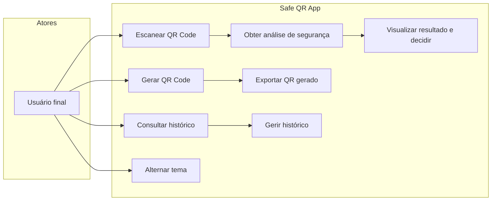

# 05 — Casos de uso

## Diagrama de casos de uso

---

## CU-01 — Escanear e analisar QR

**Ator:** Usuário final  
**Pré-condição:** App aberto, permissão de câmera concedida (ou solicitada pelo SO)  
**Pós-condição:** Resultado exibido; em modo remote o histórico é gravado pelo back (não pelo app)

### Fluxo principal

1. Usuário abre aba **Ler** (câmera visível)
2. App detecta código via `mobile_scanner`
3. Overlay fullscreen **"Analisando QR Code"** é exibido
4. `QrReaderViewModel.analyzeDecoded()` executa análise
5. Em `remote`: só analyze (histórico gravado pelo back); em `local`: analyze local sem gravar scan no histórico
6. App navega para `ScanResultPage` com veredito e razões
7. Usuário escolhe: **Abrir destino** (se URL e `safeToOpen`), **Copiar**, ou **Voltar**

### Extensões

| Código | Condição | Comportamento |
|--------|----------|---------------|
| E1 | Falha de rede (modo remote) | Mensagem amigável; overlay fecha |
| E2 | Timeout | `AppStrings.timeoutError` |
| E3 | Conteúdo vazio | Ignorado silenciosamente |
| E4 | Pedido em andamento | Debounce — ignora nova leitura |

### Tempo de loading

| Modo | Duração do overlay |
|------|-------------------|
| `remote` | Tempo real da API |
| `local` | Mínimo de **3 segundos** + heurística (~200ms simulados) |

---

## CU-02 — Abrir URL após análise

**Pré-condição:** Resultado exibido; conteúdo parece URL  
**Fluxo:**

1. Usuário toca **"Abrir destino"**
2. App valida se `safeToOpen == true` (botão habilitado)
3. `url_launcher` abre no **navegador externo** (`LaunchMode.externalApplication`)
4. App permanece em segundo plano

**Nota de segurança:** Não usa WebView embutido.

---

## CU-03 — Gerar QR Code

**Ator:** Usuário final

### Fluxo principal

1. Usuário abre aba **Gerar**
2. Seleciona tipo: texto, URL, imagem (link), Wi-Fi, e-mail, telefone, SMS
3. Preenche campos do formulário
4. Toca **"Gerar QR Code"**
5. `ValidateQrPayload` valida tamanho (1–2000 caracteres)
6. Overlay **"Gerando QR Code"** por 2 segundos
7. Payload construído via `QrPayloadBuilder`
8. Item salvo no histórico (`type: generated`)
9. Navega para `QrGeneratorResultPage` com QR renderizado

### Tipos e formatos de payload

| Tipo | Formato gerado |
|------|----------------|
| Texto | String literal |
| URL | `https://...` (prefixo automático se sem scheme) |
| Imagem (URL) | URL apontando para imagem |
| Wi-Fi | `WIFI:T:WPA;S:ssid;P:pass;;` |
| E-mail | `mailto:addr?subject=...&body=...` |
| Telefone | `tel:numero` |
| SMS | `sms:numero?body=...` |

---

## CU-04 — Exportar QR gerado

**Pré-condição:** `QrGeneratorResultPage` aberta

| Ação | Pacote | Fluxo |
|------|--------|-------|
| Salvar no dispositivo | `gal` | `Gal.requestAccess()` → grava PNG na galeria |
| Compartilhar | `share_plus` | Gera bytes PNG via `QrPngBytes` → share sheet nativo |

---

## CU-05 — Consultar histórico

**Fluxo:**

1. Usuário abre aba **Histórico**
2. `QrHistoryViewModel.load()` — `GET /v1/history` (remote) ou SQLite (local)
3. Lista exibe cards com tipo, preview do conteúdo, data, veredito (se scan)
4. Pull-to-refresh recarrega da mesma fonte

### Detalhe do item

- **Toque** no card → `showModalBottomSheet` com conteúdo completo e razões

---

## CU-06 — Gerir histórico

| Ação | Método | Confirmação |
|------|--------|-------------|
| Selecionar | Long press no card | Não |
| Apagar um | Swipe-to-delete (sem seleção ativa) | Não |
| Apagar selecionados | Barra inferior → `removeMany` | Dialog de confirmação |

---

## CU-07 — Alternar tema

**Local:** AppBar do shell (ícone de tema)

Alternância: **Escuro ↔ Claro**. Padrão primeira vez: escuro.

Persistido em `SharedPreferences` via `AppThemeModeController` (`light` / `dark`).

---

## CU-08 — Inicialização do app

1. `SplashPage` exibe identidade visual (escudo, tagline)
2. Timer de **1,4 s**
3. `pushReplacement` para `MainShellPage`
4. Bootstrap: Firebase + identidade anónima + token (modo remote); sem ecrã de login

---

## CU-09 — Health check (sistema, debug)

**Ator:** Desenvolvedor / bootstrap do app  
**Condição:** `kDebugMode && ANALYZE_MODE=remote`

1. No `configureDependencies()`, app chama `GET /v1/health`
2. Log de sucesso ou falha com dica de IP (emulador vs físico)
3. App inicia normalmente mesmo se health falhar

---

## Rastreabilidade RF → CU

| RF | Caso de uso |
|----|-------------|
| RF-M01 | CU-08 |
| RF-M02, RF-M03 | CU-01 |
| RF-M04, RF-M05 | CU-01 |
| RF-M06 | CU-02 |
| RF-M07 | CU-08 (shell) |
| RF-M08, CU-04 | CU-03, CU-04 |
| RF-M09 | CU-05, CU-06 |
| RF-M10 | CU-01 (E1, E2) |
