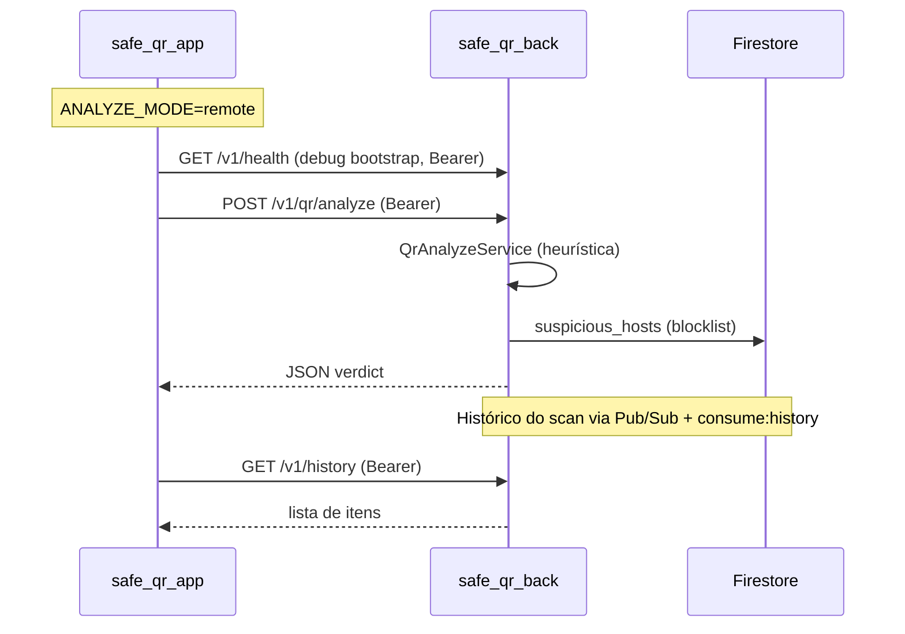

# 07 — API e integração com backend

## Visão geral

O app integra com **`safe_qr_back`** (Node.js/Fastify) quando `ANALYZE_MODE=remote`. Em modo `local`, nenhuma chamada HTTP de análise é feita.



## Configuração

Arquivo: `assets/.env`

| Chave | Descrição | Exemplo |
|-------|-----------|---------|
| `API_BASE_URL` | Base sem barra final | `http://10.0.2.2:3000` |
| `ANALYZE_MODE` | `local` ou `remote`/`api`/`server` | `remote` |
| `API_CONNECT_TIMEOUT_MS` | Timeout conexão Dio | `20000` |
| `API_RECEIVE_TIMEOUT_MS` | Timeout resposta Dio | `20000` |

### URLs por ambiente

| Ambiente | `API_BASE_URL` |
|----------|----------------|
| Android Emulator | `http://10.0.2.2:3000` |
| Celular físico (mesma Wi-Fi) | `http://<IP-LAN-PC>:3000` |
| iOS Simulator / desktop | `http://127.0.0.1:3000` |

**Erro comum:** usar `10.0.2.2` em celular físico — esse host só existe no emulador Android.

Constantes Dart: `lib/core/constants/app_endpoints.dart`, `app_env_keys.dart`

---

## Endpoints consumidos

| Método | Path | Uso no app |
|--------|------|------------|
| `GET` | `/v1/health` | Probe de debug no bootstrap (modo remote) |
| `POST` | `/v1/qr/analyze` | Análise de conteúdo QR |
| `GET` | `/v1/history` | Listar histórico (modo remote) |
| `DELETE` | `/v1/history/{id}` | Apagar item(s) selecionado(s) |
| `POST` | `/v1/history` | QR gerado — botão “Salvar no histórico” |

Definição:

```dart
abstract final class AppEndpoints {
  static const String v1Root = '/v1';
  static const String health = '$v1Root/health';
  static const String qrAnalyze = '$v1Root/qr/analyze';
  static const String history = '$v1Root/history';
  static String historyItem(String id) => '$history/$id';
}
```

---

## `GET /v1/health`

### Request

```http
GET /v1/health HTTP/1.1
Host: <API_BASE_URL>
Accept: application/json
Authorization: Bearer <Firebase ID Token>
```

Bearer injetado por `AuthenticatedAppNetwork` em **todos** os pedidos ao back.

### Response `200`

```json
{
  "status": "ok",
  "service": "safe-qr-api",
  "version": "0.1.0"
}
```

**Implementação no app:** `dependency_injection.dart` → `_debugProbeBackendHealth()` (apenas `kDebugMode`).

---

## `POST /v1/qr/analyze`

### Request

Implementado em `RemoteQrAnalyzeRepository`:

**Headers:**

```http
Authorization: Bearer <Firebase ID Token>
Content-Type: application/json
```

Bearer via `AuthenticatedAppNetwork` → `UserIdentityService.getIdToken()`.

**Body:**

```json
{
  "rawContent": "https://exemplo.com/pagamento",
  "client": {
    "appVersion": "1.0.0",
    "platform": "android"
  }
}
```

| Campo | Origem no app |
|-------|---------------|
| `rawContent` | Conteúdo escaneado (clip 2000 chars) |
| `client.appVersion` | `AppBuildInfo.versionLabel` |
| `client.platform` | `android`, `ios`, `web`, etc. |

O UID do utilizador vem **só do JWT** (`Authorization: Bearer …`). Não enviar UID no body.

Detalhes de identidade: [17-identidade-firebase-anonymous.md](./17-identidade-firebase-anonymous.md).

### Response `200`

```json
{
  "requestId": "uuid",
  "verdict": "suspicious",
  "safeToOpen": false,
  "reasons": [
    "URL usa redirecionador conhecido (destino não visível diretamente)."
  ],
  "parsed": {
    "type": "url",
    "scheme": "https",
    "host": "exemplo.com"
  }
}
```

### Deserialização no app

1. `QrAnalyzeDto.fromJson()` — aceita camelCase e snake_case (`request_id`, `safe_to_open`)
2. `QrAnalysisMappers.toDomain()` → `QrAnalysisResult`

### Valores de `verdict`

| Valor | `safeToOpen` típico | UI |
|-------|---------------------|-----|
| `safe` | `true` | Botão abrir habilitado |
| `suspicious` | `false` | Abrir desabilitado ou com aviso |
| `unsafe` | `false` | Não abrir |
| `unknown` | `false` | Cautela |

---

## Erros da API

| Status | Corpo (exemplo) | Tratamento no app |
|--------|-----------------|-------------------|
| `400` | `VALIDATION_ERROR` | `AppHttpException` → mensagem de rede |
| `401` | `UNAUTHORIZED` | Token ausente/inválido → `AppStrings.identityError` |
| `413` | `PAYLOAD_TOO_LARGE` | `AppHttpException` |
| `500` | `INTERNAL_ERROR` | `AppHttpException` |
| Timeout | — | `AppStrings.timeoutError` (status 408 mapeado) |
| Sem rede | — | `AppStrings.networkError` |

Camada: `DioAppNetwork` → exceções → `QrReaderViewModel`

---

## Modos de análise

| Modo | Variável `.env` | Repositório | Motor |
|------|-----------------|-------------|-------|
| **Local** | `ANALYZE_MODE=local` | `LocalHeuristicQrAnalyzeRepository` | `QrLocalHeuristicEngine` |
| **Remote** | `ANALYZE_MODE=remote` | `RemoteQrAnalyzeRepository` | API + Firestore (backend) |

### Diferenças local vs remote

| Aspecto | Local | Remote |
|---------|-------|--------|
| Dados enviados | Nenhum | `rawContent` + metadados cliente |
| Blocklist Firestore | Não | Sim (server-side) |
| Atualização de regras | Requer novo build | Deploy do backend |
| Loading mínimo | 3 segundos | Tempo real da API |
| Funciona offline | Sim | Não |

---

## Camada de rede (`AppNetwork`)

```dart
abstract class AppNetwork {
  Future<Map<String, dynamic>> get(...);
  Future<Map<String, dynamic>> post(...);
  Future<void> delete(...);
}
```

Implementação em camadas:

| Classe | Papel |
|--------|-------|
| `DioAppNetwork` | Dio + mapeamento de erros |
| `AuthenticatedAppNetwork` | Injeta `Authorization: Bearer <token>` em todos os pedidos |

Configuração Dio:

- `baseUrl` = `AppConfig.apiBaseUrl`
- `Accept: application/json` global
- `Content-Type: application/json` **apenas em POST** (GET/DELETE sem body — evita `FST_ERR_CTP_EMPTY_JSON_BODY` no Fastify)
- Timeouts de `AppConfig`

---

## Histórico remoto

| Operação | Quem faz |
|----------|----------|
| Scan → analyze | App (`POST /v1/qr/analyze` + Bearer) — **sem** gravar histórico no app |
| Gravar scan no histórico | Back + `safe_qr_messaging` (Pub/Sub → Firestore) |
| Listar histórico | App (`GET /v1/history` + Bearer) via `RemoteHistoryRepository` |
| Apagar item(ns) | App (`DELETE /v1/history/{id}` + Bearer) |
| QR gerado | App (`POST /v1/history` + Bearer) ao salvar no gerador |

Modo `ANALYZE_MODE=local`: histórico em **SQLite** (`HistoryRepositoryImpl`).

Ver: [08-dados-persistencia.md](./08-dados-persistencia.md), [safe_qr_messaging/docs/02-FANOUT-HISTORICO-AUDIT.md](../../safe_qr_messaging/docs/02-FANOUT-HISTORICO-AUDIT.md).

---

## Firebase — papéis distintos

| Componente | SDK | Papel atual |
|------------|-----|-------------|
| App Flutter | `firebase_core` + `firebase_auth` | Sessão anónima → Bearer JWT |
| Backend | `firebase-admin` | Blocklist + verify token + histórico CRUD |
| `safe_qr_messaging` | `firebase-admin` | Grava `history/...` e `scan_events` |

---

## Testar integração

1. Subir backend: `cd safe_qr_back && npm run dev`
2. Subir consumidor histórico: `cd safe_qr_messaging && npm run consume:history`
3. Descobrir IP: `ipconfig` (Windows)
4. Configurar `assets/.env`: `API_BASE_URL=http://<IP>:3000`, `ANALYZE_MODE=remote`
5. Rebuild Flutter: `flutter run`
6. Escanear QR → aba Histórico → pull-to-refresh

Documentação backend: [`../../safe_qr_back/docs/10-integracao-mobile.md`](../../safe_qr_back/docs/10-integracao-mobile.md)

---

## Checklist ao alterar contrato

Atualizar simultaneamente:

- [ ] Schema Zod no backend
- [ ] `QrAnalyzeDto` / `QrAnalysisMappers` no Flutter
- [ ] Testes backend (`test/qr-analyze.test.ts`)
- [ ] `test/features/qr_scanner/qr_analyze_dto_test.dart`
- [ ] Esta documentação e `05-api-endpoints.md` do backend
