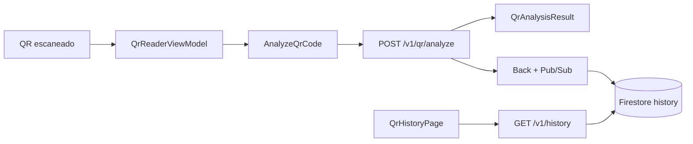
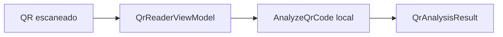

# 08 — Dados e persistência

## Visão geral

| Armazenamento | Tecnologia | Conteúdo |
|---------------|------------|----------|
| Histórico (local) | SQLite (`sqflite`) | Scans e QR gerados — `ANALYZE_MODE=local` |
| Histórico (remoto) | Firestore via API | `GET /v1/history` — scans via Pub/Sub + `consume:history` |
| Identidade | Firebase Anonymous Auth | UID + JWT (sem conta real) |
| Preferências | `shared_preferences` | Modo de tema |
| Config runtime | `assets/.env` | URL API, modo análise, timeouts |
| Memória | ViewModels | Estado transitório da UI |

Modo remoto: o app **não** grava scan localmente após analyze — o histórico vem do servidor.

---

## Entidades de domínio

### `QrSecurityVerdict` (enum)

```dart
enum QrSecurityVerdict { safe, suspicious, unsafe, unknown }
```

### `QrAnalysisResult`

| Campo | Tipo | Descrição |
|-------|------|-----------|
| `requestId` | String | UUID (API ou gerado localmente) |
| `verdict` | `QrSecurityVerdict` | Classificação |
| `safeToOpen` | bool | Indicação prática para UI |
| `reasons` | `List<String>` | Explicações em pt-BR |
| `parsed` | `QrParsedSummary?` | Metadados parseados |

### `QrParsedSummary`

| Campo | Tipo | Exemplos |
|-------|------|----------|
| `type` | String? | `url`, `text`, `wifi`, `vcard`, `empty` |
| `scheme` | String? | `https`, `mailto`, `javascript` |
| `host` | String? | `exemplo.com` |

### `HistoryItem`

| Campo | Tipo | Descrição |
|-------|------|-----------|
| `id` | String | UUID v4 |
| `type` | `HistoryItemType` | `scan` ou `generated` |
| `content` | String | Payload completo do QR |
| `createdAt` | DateTime | Momento da operação |
| `verdict` | String? | Nome do enum (scans) |
| `safeToOpen` | bool? | Resultado da análise (scans) |
| `reasons` | `List<String>` | Razões da análise (scans) |

---

## DTOs (camada data)

### `QrAnalyzeDto`

Deserializa resposta JSON da API. Suporta aliases:

- `requestId` / `request_id`
- `safeToOpen` / `safe_to_open`

### `QrParsedDto`

Sub-objeto `parsed` da resposta da API.

### Mappers

| Mapper | Direção |
|--------|---------|
| `QrAnalysisMappers.toDomain()` | DTO → `QrAnalysisResult` |
| `HistoryDataMapper.toRow()` | `HistoryItem` → Map SQLite |
| `HistoryDataMapper.fromRow()` | Map SQLite → `HistoryItem` |

---

## SQLite

### Bootstrap

Classe: `AppDatabaseBootstrapper`  
Arquivo: `safe_qr.db` (diretório de documentos do app)  
Schema version: `1` (definido em `AppDatabaseNames`)

### Tabela `history`

```sql
CREATE TABLE history(
  id TEXT NOT NULL PRIMARY KEY,
  type TEXT NOT NULL,
  content TEXT NOT NULL,
  created_at_ms INTEGER NOT NULL,
  verdict TEXT,
  safe_to_open INTEGER,
  reasons_json TEXT
);
CREATE INDEX idx_history_time ON history(created_at_ms);
```

| Coluna | Tipo SQLite | Mapeamento |
|--------|-------------|------------|
| `id` | TEXT | `HistoryItem.id` |
| `type` | TEXT | `scan` / `generated` |
| `content` | TEXT | Payload raw |
| `created_at_ms` | INTEGER | `createdAt.millisecondsSinceEpoch` |
| `verdict` | TEXT NULL | `verdict` (string do enum) |
| `safe_to_open` | INTEGER NULL | `1`/`0`/`NULL` |
| `reasons_json` | TEXT NULL | `jsonEncode(reasons)` |

### Repositório

`HistoryRepositoryImpl` implementa:

```dart
abstract class HistoryRepository {
  Future<void> add(HistoryItem item);
  Future<List<HistoryItem>> list();
  Future<void> deleteById(String id);
  Future<void> clear();
}
```

`list()` ordena por `created_at_ms DESC`.

---

## SharedPreferences

| Chave | Valor | Controller |
|-------|-------|------------|
| `safe_qr_theme_mode` (configurável) | `light`, `dark` (padrão: escuro se ausente) | `AppThemeModeController` |

Chave definida por `THEME_PERSISTENCE_KEY` no `.env`.

---

## Fluxo de dados — scan

### Modo `remote`



### Modo `local`



Scans em `local` **não** são gravados automaticamente no histórico (só QR gerados via gerador).

## Fluxo de dados — geração

| Modo | Destino |
|------|---------|
| `local` | SQLite via `AddHistoryItem` |
| `remote` | `POST /v1/history` ao salvar no gerador |

---

## Limites de tamanho

| Contexto | Limite |
|----------|--------|
| Análise (clip no ViewModel) | 2000 caracteres |
| Validação de geração | 1–2000 caracteres |
| API backend (bytes UTF-8) | 8192 bytes (padrão backend) |
| API backend (Zod) | max 200.000 caracteres |

O app clipa em 2000 antes de enviar — alinhado ao uso mobile, mas menor que o limite do backend.

---

## Modelo conceitual (evolução)

Diagrama acadêmico em [`../../docs/SPRINT-1-ENTREGAVEIS.md`](../../docs/SPRINT-1-ENTREGAVEIS.md) seção 9:

- `USER` (futuro)
- `QR_SCAN` / `QR_GENERATION` (server-side futuro)
- Modo `local`: tabela `history` SQLite
- Modo `remote`: histórico na nuvem (`GET/DELETE /v1/history`)
