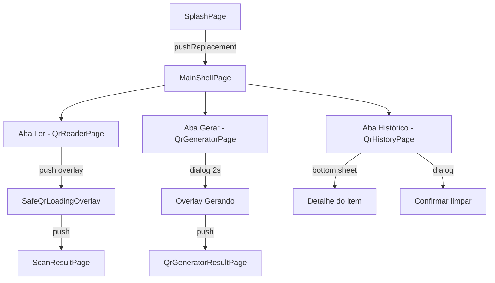

# 09 — Navegação e UI

## Estratégia de navegação

O app usa navegação **imperativa** com `Navigator` do Flutter. Não há:

- `go_router` ou rotas nomeadas
- Deep links
- Guard de autenticação

## Mapa de telas

## Rotas e transições

| De | Para | Mecanismo | Nome / notas |
|----|------|-----------|--------------|
| `SplashPage` | `MainShellPage` | `pushReplacement` | Remove splash da pilha |
| `QrReaderPage` | Loading overlay | `PageRouteBuilder` fullscreen | `RouteSettings.name: 'QrReaderAnalyzing'` |
| `QrReaderPage` | `ScanResultPage` | `MaterialPageRoute` push | Recebe `result` + `raw` |
| `QrGeneratorPage` | Overlay gerando | `showDialog` (root navigator) | 2 segundos fixos |
| `QrGeneratorPage` | `QrGeneratorResultPage` | `MaterialPageRoute` push | Recebe `payload` |
| `QrHistoryPage` | Detalhe | `showModalBottomSheet` | Toque no card — conteúdo + razões |
| `QrHistoryPage` | Seleção | Long press no card | Checkbox visual |
| `QrHistoryPage` | Apagar selecionados | Barra inferior + `showDialog` | Confirmação |
| `QrHistoryPage` | Apagar um | `Dismissible` swipe | Sem seleção ativa |

### Shell — abas

`MainShellPage` usa `IndexedStack` para preservar estado das 3 abas ao alternar. A navegação entre abas **não altera a pilha** do `Navigator`.

---

## Tema e identidade visual

### Material 3

- Temas light e dark em `AppTheme`
- Tokens customizados: `SafeQrColorTokens` (muted, accent, etc.)
- `ThemeData.useMaterial3: true`

### Tipografia

| Uso | Fonte |
|-----|-------|
| Títulos, UI geral | Plus Jakarta Sans (`google_fonts`) |
| Conteúdo raw do QR | JetBrains Mono |

### Ciclo de tema

Widget: `ThemeCycleAction` no AppBar do shell

Alternância: **Escuro ↔ Claro** (ícone indica o próximo modo).

- Primeira abertura (sem preferência salva): **escuro**
- Valor antigo `system` em cache: tratado como escuro até o utilizador mudar

Persistido via `AppThemeModeController` + `SharedPreferences` (`light` / `dark`).

---

## Componentes compartilhados (`shared/presentation/widgets/`)

| Widget | Uso |
|--------|-----|
| `SafeQrLoadingOverlay` | Análise e geração de QR |
| `AppHeroHeader` | Cabeçalho com título/subtítulo nas abas |
| `AppRoundedActionButton` | Botões de ação principal |
| `AppBusyOverlay` | Overlay de ocupado genérico |
| `ThemeCycleAction` | Ícone de alternância de tema |

---

## Tela de resultado do scan (`ScanResultPage`)

### Elementos

- `VerdictBadge` — cor e ícone por veredito
- Headline contextual por veredito
- Conteúdo raw em caixa monoespaçada (selecionável)
- Lista de razões (`result.reasons`)
- Metadados parseados (`parsed.type`, `scheme`, `host`)

### Ações

| Botão | Condição | Comportamento |
|-------|----------|---------------|
| Abrir destino | URL detectada + `safeToOpen` | `url_launcher` externo |
| Copiar | Sempre | `Clipboard.setData` |
| Voltar | Sempre | `Navigator.pop` |

**Segurança:** URLs abrem no navegador do sistema, não em WebView.

---

## Tela do gerador — formulário dinâmico

Campos variam por `QrGenerationType`:

| Tipo | Campos |
|------|--------|
| Texto / URL / Imagem | Campo principal (`draft`) |
| Wi-Fi | SSID, senha, tipo segurança (WPA/WEP/NOPASS) |
| E-mail | Endereço, assunto, corpo |
| Telefone | Número |
| SMS | Número, mensagem |

Sem pré-visualização do QR no formulário — resultado só após push.

---

## Histórico — UX

- Cards com ícone por tipo (scan vs gerado)
- Data formatada (`intl`)
- Badge de veredito para scans
- Swipe horizontal para deletar
- Pull-to-refresh
- Estado vazio com mensagem orientativa

---

## Strings da UI

Centralizadas em `lib/core/constants/app_strings.dart` (pt-BR).

Exemplos de chaves:

- `resultTitle`, `readerResultHint`
- `networkError`, `timeoutError`
- Labels das abas e botões

---

## Acessibilidade e UX

- Overlay de análise é **non-dismissible** (usuário não pode fechar acidentalmente)
- Debounce/cooldown no leitor evita múltiplas análises do mesmo QR
- Feedback visual de erro via `SnackBar` ou texto no leitor (`QrReaderViewModel.error`)
- Conteúdo raw é `SelectableText` para copiar manualmente
