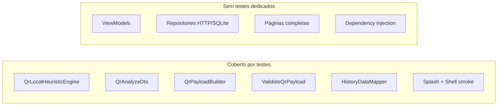

# 13 — Testes

## Visão geral

| Tipo | Framework | Localização |
|------|-----------|-------------|
| Unitários | `flutter_test` | `test/features/**` |
| Smoke / widget | `flutter_test` | `test/features/**`, `test/widget_test.dart` |
| Mocks | `mocktail` | Disponível para expansão |

## Executar testes

```bash
cd safe_qr_app
flutter test
```

Com cobertura (opcional):

```bash
flutter test --coverage
```

Análise estática:

```bash
flutter analyze
```

---

## Inventário de testes

### QR Scanner

| Arquivo | O que testa |
|---------|-------------|
| `test/features/qr_scanner/qr_analyze_dto_test.dart` | Deserialização JSON da API (camelCase, snake_case) |
| `test/features/qr_scanner/qr_local_heuristic_engine_test.dart` | Regras heurísticas: esquemas, encurtadores, IP, https |

### QR Generator

| Arquivo | O que testa |
|---------|-------------|
| `test/features/qr_generator/validate_qr_payload_test.dart` | Validação de tamanho 1–2000 chars |
| `test/features/qr_generator/qr_payload_builder_test.dart` | Construção de payloads por tipo |

### QR History

| Arquivo | O que testa |
|---------|-------------|
| `test/features/qr_history/history_data_mapper_test.dart` | Mapeamento entidade ↔ row SQLite |
| `test/features/qr_history/history_api_mapper_test.dart` | Mapeamento entidade ↔ JSON `/v1/history` |

### Splash e Shell

| Arquivo | O que testa |
|---------|-------------|
| `test/features/splash/splash_smoke_test.dart` | Splash renderiza e navega |
| `test/features/shell/shell_smoke_test.dart` | Shell com 3 abas renderiza |

### Geral

| Arquivo | O que testa |
|---------|-------------|
| `test/widget_test.dart` | Teste widget padrão do template Flutter |

---

## Cobertura por camada



---

## Convenções para novos testes

1. Espelhar path: `lib/features/X/foo.dart` → `test/features/X/foo_test.dart`
2. Nomear grupos com `group('descrição', () { ... })`
3. Usar `mocktail` para isolar repositórios em testes de ViewModel
4. Testes de heurística: casos positivos e negativos por esquema/veredito
5. DTO: testar aliases snake_case da API

### Exemplo de caso heurístico

```dart
// https sem sinais → safe
// bit.ly → suspicious
// javascript: → unsafe
// WIFI: → unknown
```

---

## Testes de integração (manual)

Não há `integration_test/` automatizado. Checklist manual:

| Cenário | Passos |
|---------|--------|
| Scan local | `ANALYZE_MODE=local`, escanear URL https |
| Scan remote | Backend rodando, `ANALYZE_MODE=remote` |
| Erro de rede | Backend offline, verificar mensagem |
| Gerar + salvar | Gerar QR, salvar na galeria |
| Histórico | Verificar persistência após restart |
| Tema | Alternar e reiniciar app |

---

## CI recomendado

```yaml
steps:
  - run: flutter pub get
  - run: flutter analyze
  - run: flutter test
```

Meta RNF-08: pelo menos smoke + contrato API (backend) no pipeline.

---

## Relação com testes do backend

O backend em `safe_qr_back/test/` valida o contrato HTTP que o app consome:

- `qr-analyze.test.ts` — POST `/v1/qr/analyze`
- `suspicious-hosts-match.test.ts` — blocklist Firestore

Alterações no contrato devem atualizar testes em **ambos** os projetos.
