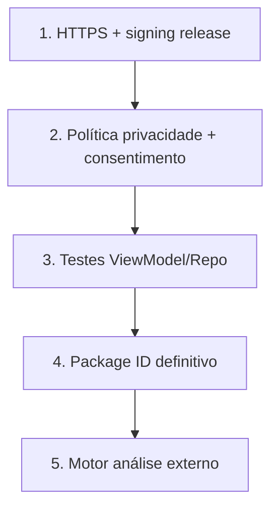

# 15 — Roadmap e gaps conhecidos

## Estado atual

O app evoluiu além do protótipo estático da Sprint 1:

| Área | Sprint 1 (planejado) | Estado atual |
|------|---------------------|--------------|
| Leitor | Placeholder / simular | Câmera real (`mobile_scanner`) |
| Análise | Stub/mock | Heurística local + API remota |
| Gerador | Preview estático | Geração real + export PNG |
| Histórico | Lista mock | SQLite persistente |
| Backend | Health + stub | Fastify + Firestore blocklist |

---

## Débitos técnicos

| Item | Severidade | Descrição |
|------|------------|-----------|
| Package ID `com.example.*` | Média | Alterar antes de publicação |
| Release signing (Android) | Alta | Usa debug keys |
| README raiz genérico | Baixa | Substituído por `docs/` |
| `cloud_firestore` não usado | Baixa | Dependência órfã no app |
| Cleartext HTTP (Android) | Média (prod) | OK para dev, remover em prod |
| `AppBuildInfo` manual | Baixa | Dessincronia possível com pubspec |
| Permissão câmera negada | Média | Sem fluxo dedicado de re-pedido |
| iOS ATS para HTTP local | Média | Pode bloquear dev sem exceção plist |
| Sem `go_router` / deep links | Baixa | Aceitável para MVP |
| Sem testes de ViewModel/Repo | Média | Cobertura parcial |

---

## Evolução planejada (pós-S1)

Baseado em [`../../docs/SPRINT-1-ENTREGAVEIS.md`](../../docs/SPRINT-1-ENTREGAVEIS.md) seção 12 e backend `11-roadmap-evolucao.md`:

### Curto prazo

1. **Motor de análise avançado** — Google Safe Browsing, VirusTotal, listas curadas
2. **Política de privacidade** — UI + consentimento para modo remote
3. **Assinatura release** — Pipeline CI com keystore
4. **Testes de integração** — `integration_test` para fluxo scan completo
5. **Firestore no app** — sync opcional de histórico (se houver contas)

### Médio prazo

1. **Autenticação** — conta anônima ou OAuth
2. **Histórico server-side** — PostgreSQL / Firestore com `user_id`
3. **Push notifications** — FCM + SNS para alertas de ameaças
4. **Threat intel assíncrona** — SQS + workers (não bloquear UX)
5. **Publicação** — Play Store / App Store

### Longo prazo

1. **ML on-device** — TensorFlow Lite como primeira camada
2. **Homoglyph / typosquatting** — detecção avançada de domínios
3. **Modo enterprise** — políticas corporativas, MDM
4. **Web app** — scanner via webcam

---

## Sprint 2 (referência)

Ver status em [`../../docs/SPRINT-2-STATUS-E-PROXIMA-ENTREGA.md`](../../docs/SPRINT-2-STATUS-E-PROXIMA-ENTREGA.md) no monorepo.

---

## Prioridades sugeridas para o time

---

## O que NÃO fazer ainda

- Adicionar autenticação sem definir modelo de dados server-side
- Enviar histórico para API sem política de retenção LGPD
- Publicar com cleartext HTTP habilitado
- Substituir heurística local sem fallback offline

---

## Como propor mudanças

1. Abrir issue com contexto e RF/RNF afetados
2. Atualizar docs **antes ou junto** do código
3. Manter paridade local/remote nas heurísticas
4. Adicionar testes para comportamento novo
