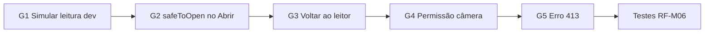

# 16 — Requisitos do app: conformidade e backlog

**Escopo:** apenas `safe_qr_app` (RF-M + RNF aplicáveis ao mobile).  
**Fora deste documento:** RF-B*, deploy, CRUD servidor, Firestore admin, Pub/Sub.

**Referência:** [`../../docs/SPRINT-1-ENTREGAVEIS.md`](../../docs/SPRINT-1-ENTREGAVEIS.md) seções 2.1 e 3.

---

## Matriz de conformidade (RF-M)

| ID | Requisito | Prioridade | Status | Evidência / notas |
|----|-----------|------------|--------|-------------------|
| RF-M01 | Splash ao iniciar | Must | ✅ Atendido | `SplashPage` → timer 1,4s |
| RF-M02 | Leitor no fluxo principal (aba) | Must | ✅ Atendido | `MainShellPage` aba Ler |
| RF-M03 | Câmera **ou entrada simulada em dev** | Must | ⚠️ Parcial | Câmera OK; **falta simulação em debug** |
| RF-M04 | Enviar conteúdo para análise (backend) | Must | ✅ Atendido | `ANALYZE_MODE=remote` + `RemoteQrAnalyzeRepository`; local como alternativa documentada |
| RF-M05 | Resultado: classificação + motivos | Must | ✅ Atendido | `ScanResultPage`, `VerdictBadge`, `reasons` |
| RF-M06 | Ações: abrir URL, copiar, voltar, cancelar | Should | ⚠️ Parcial | Ver gaps G1–G4 abaixo |
| RF-M07 | Menu 3 abas | Must | ✅ Atendido | Ler / Gerar / Histórico |
| RF-M08 | Gerador texto/URL + QR visual | Should | ✅ Atendido | Excede S1 (7 tipos, export PNG) |
| RF-M09 | Histórico | Should | ✅ Atendido | SQLite (`local`) ou API (`remote`); seleção + apagar |
| RF-M10 | Erros rede/timeout amigáveis | Should | ⚠️ Parcial | SnackBar OK; **falta mensagem 413** e permissão câmera |

### Legenda

- ✅ Atendido — comportamento implementado e testável
- ⚠️ Parcial — existe mas com lacuna documentada
- ❌ Pendente — não implementado

---

## Gaps detalhados (só app)

### G1 — RF-M03: entrada simulada em dev

**Problema:** o enunciado S1 prevê câmera **ou** entrada simulada para demo sem hardware.

**Proposta:**

- Botão visível apenas em `kDebugMode` na `QrReaderPage`
- Campo/dialog com texto/URL → chama o mesmo fluxo `_onBarcodeDetected` / `analyzeDecoded`
- Label: "Simular leitura (dev)"

**Arquivos:** `qr_reader_page.dart`, `app_strings.dart`

---

### G2 — RF-M06: botão "Abrir" ignora `safeToOpen`

**Problema:** `ScanResultPage` exibe "Abrir no navegador" para qualquer URL HTTP(S), mesmo quando `safeToOpen == false`.

**Proposta:**

- Se `!result.safeToOpen`: botão desabilitado **ou** habilitado com dialog de confirmação explícita
- Alinhar com decisão de produto: recomendamos **desabilitar + texto explicativo** para `unsafe`/`suspicious`

**Arquivos:** `scan_result_page.dart`, `app_strings.dart`

---

### G3 — RF-M06: ações de navegação pós-resultado

**Problema:** existe string `backToReader` não usada; botão atual diz "Permanecer no app".

**Proposta:**

- Renomear botão para **"Voltar ao leitor"** (`AppStrings.backToReader`)
- Manter `Navigator.pop()` (retorna à aba Ler com câmera ativa)
- AppBar `close` = **cancelar** (mesmo efeito — documentar como atendido)

**Arquivos:** `scan_result_page.dart`

---

### G4 — RF-M10 / UX: permissão de câmera negada

**Problema:** `permissionCameraDenied` definida mas nunca exibida; usuário vê tela preta sem orientação.

**Proposta:**

- Escutar estado do `MobileScannerController` (erro / sem permissão)
- Exibir card com mensagem + botão "Abrir configurações" (`openAppSettings` do `permission_handler` **ou** instrução textual se evitar nova dependência)

**Arquivos:** `qr_reader_page.dart`, possivelmente `pubspec.yaml` se usar `permission_handler`

---

### G5 — RF-M10: erro HTTP 413

**Problema:** payload grande retorna `AppHttpException` genérico.

**Proposta:**

- String `payloadTooLargeError` em `AppStrings`
- Em `QrReaderViewModel`, tratar `statusCode == 413`

**Arquivos:** `qr_reader_view_model.dart`, `app_strings.dart`

---

## RNF aplicáveis ao app (não-backend)

| ID | Requisito | Status | Ação no app |
|----|-----------|--------|-------------|
| RNF-01 | TLS em produção | ⚠️ | Manter cleartext só em debug; documentar `API_BASE_URL=https://...` para release; validar em build release |
| RNF-02 | Privacidade documentada | ✅ | `docs/12-seguranca-privacidade.md` |
| RNF-03 | Análise < 2s P95 | ⚠️ | Modo local força 3s mínimo (UX); aceitável S1 — revisar se professor exigir |
| RNF-07 | Android first | ✅ | minSdk 24, APK testado |
| RNF-08 | Testes no app | ⚠️ | Unitários existem; faltam testes de `ScanResultPage` / ViewModel |

---

## Débitos técnicos (pré-loja, não bloqueiam RF S1)

| Item | Impacto |
|------|---------|
| `com.example.safe_qr_app` | Publicação |
| Release signing com debug keys | Publicação |
| `cloud_firestore` sem uso | Limpeza de dependência ou implementar |
| `AppBuildInfo` manual vs pubspec | Metadados enviados à API |

---

## Plano de execução sugerido (só app)

### Sprint de conformidade — ordem recomendada

| Fase | Itens | Esforço estimado |
|------|-------|------------------|
| **P0 — Must** | G1 (simular leitura) | ~1–2h |
| **P1 — Should RF-M06** | G2, G3 | ~1h |
| **P2 — Should RF-M10** | G4, G5 | ~2h |
| **P3 — Qualidade** | Testes ViewModel + widget resultado | ~2h |
| **P4 — Pré-release** | package ID, signing (fora S1 acadêmico) | variável |

---

## Critérios de "pronto" (app)

- [ ] Todos RF-M Must em ✅
- [ ] RF-M06 e RF-M10 em ✅ ou ⚠️ justificado na apresentação
- [ ] `flutter test` e `flutter analyze` verdes
- [ ] Demo gravável: splash → scan (ou simular) → resultado → histórico
- [ ] `.env.example` documentado para integração com back (sem depender de back para modo local)

---

## O que **não** entra neste backlog

- CRUD / PostgreSQL no servidor
- Deploy AWS / GCP
- Pub/Sub pós-análise
- Blocklist Firestore (responsabilidade do `safe_qr_back`)
- Conta de usuário / sync histórico na nuvem

---

**Próximo passo:** implementar fase P0 + P1 (G1–G3) — maior impacto nos RF Must/Should com menor risco.
