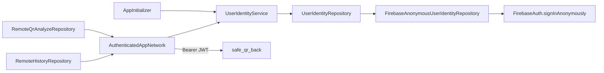

# 17 — Identidade: Firebase Anonymous Auth

## Objetivo

Fornecer identidade estável (Firebase UID) via **Bearer JWT** em todos os pedidos ao `safe_qr_back`, para correlacionar análise, histórico Firestore (`history/{uid}/items`) e eventos Pub/Sub.

**Sem** ecrã de login, e-mail ou palavra-passe — sessão anónima automática.

---

## Arquitetura no app



### Camadas (`lib/core/identity/`)

| Ficheiro | Papel |
|----------|-------|
| `user_identity_repository.dart` | Contrato (domínio) |
| `firebase_anonymous_user_identity_repository.dart` | Implementação Firebase |
| `user_identity_service.dart` | `getOrCreateIdUser()`, `getIdToken()`, `authorizationHeaders()` |
| `user_identity_exception.dart` | Erros de identidade |

Rede: `lib/core/network/authenticated_app_network.dart` — injeta o Bearer em **GET/POST/DELETE**.

### Bootstrap

1. `Firebase.initializeApp()` em `AppInitializer`
2. `configureDependencies()` regista repositório, serviço e `AuthenticatedAppNetwork`
3. `_ensureAnonymousIdentity()` chama `getOrCreateIdUser()` + `getIdToken()` (log `SafeQR.Identity`)

### Consumo nas features

| Feature | Como autentica |
|---------|----------------|
| Scan remoto | `RemoteQrAnalyzeRepository` → `AppNetwork` (Bearer automático) |
| Histórico remoto | `RemoteHistoryRepository` → `AppNetwork` (Bearer automático) |
| Health probe (debug) | `AppNetwork.get(/v1/health)` (Bearer automático) |

**Header (obrigatório em todos os endpoints do back):**

```http
Authorization: Bearer <Firebase ID Token>
```

Obtido via `UserIdentityService.getIdToken()` (encapsula `FirebaseAuth.instance.currentUser!.getIdToken()`).

O back (`FirebaseUserIdentityService`) faz `verifyIdToken` → `decoded.uid` — **nunca** confiar em UID enviado no body.

**Body do analyze** — só metadados, sem UID:

```json
"client": {
  "appVersion": "1.0.0",
  "platform": "android"
}
```

---

## Configuração manual (obrigatória)

### 1. Firebase Console

1. Abra [Firebase Console](https://console.firebase.google.com/) → projeto do app
2. **Build** → **Authentication** → **Sign-in method**
3. Ative **Anonymous** (Anónimo) → **Save**

Sem este passo o app regista `operation-not-allowed` nos logs.

### 2. Dependências Flutter

```bash
cd safe_qr_app
flutter pub get
```

Pacotes: `firebase_core` + `firebase_auth`.

### 3. Ficheiros nativos

| Plataforma | Ficheiro |
|------------|----------|
| Android | `android/app/google-services.json` |
| iOS | `ios/Runner/GoogleService-Info.plist` |
| Dart | `lib/firebase_options.dart` |

Se faltar: `flutterfire configure`

### 4. Rebuild

```bash
flutter run
```

Filtre logs: `adb logcat | findstr SafeQR.Identity`

---

## Comportamento e limites

| Cenário | Comportamento |
|---------|---------------|
| Primeiro arranque com rede | `signInAnonymously()` → UID guardado pelo SDK |
| Arranques seguintes | Reutiliza `FirebaseAuth.instance.currentUser` |
| Sem rede no 1º sign-in | `UserIdentityException`; pedidos remotos falham com mensagem amigável |
| Desinstalar / limpar dados | Novo UID anónimo |
| Modo `ANALYZE_MODE=local` | Identidade ainda criada no bootstrap; analyze não chama API |

### Formato do UID

Firebase UID anónimo (ex.: `0SWZSQken0b7JO9Fokl1IhQp01F3`) — usado pelo back via JWT, não no body do analyze.

---

## Privacidade (RNF-02)

- Não é identidade real (sem e-mail, nome ou telefone)
- UID anónimo para correlação técnica de eventos e histórico na nuvem
- Documentar na política: pseudónimo gerido pelo Firebase Auth

Ver também: [MOBILE-DADOS-EPRIVACIDADE.md](./MOBILE-DADOS-EPRIVACIDADE.md)

---

## Testes

```bash
flutter test test/core/identity/user_identity_service_test.dart
```

Testes de integração com Firebase real exigem dispositivo/emulador e Auth ativo no Console.

---

## Troubleshooting

| Log / erro | Causa | Solução |
|------------|-------|---------|
| `operation-not-allowed` | Anonymous desativado | Ativar no Console |
| `network-request-failed` | Sem internet | Wi‑Fi/dados móveis |
| Bootstrap identity falhou | Auth ou rede | Ver `SafeQR.Identity` no logcat |
| `401` na API | Token inválido/expirado | Reiniciar app; verificar Firebase |
| Histórico vazio após scan | `consume:history` parado | `cd safe_qr_messaging && npm run consume:history` |
