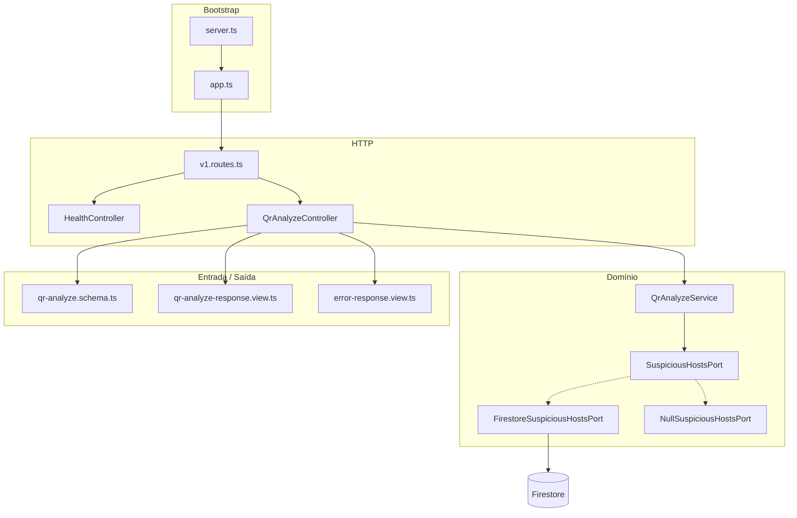
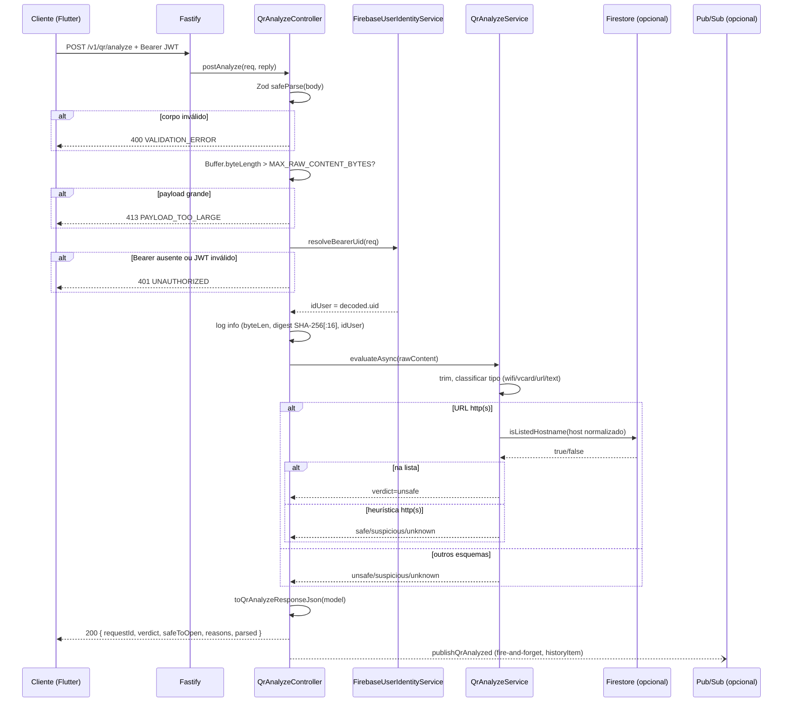

# 02 — Arquitetura

## Padrão arquitetural

O backend segue uma variante de **MVC com camadas desacopladas**, adequada a APIs REST pequenas e testáveis:

| Camada | Pasta | Responsabilidade |
|--------|-------|------------------|
| **Bootstrap** | `server.ts`, `app.ts` | Inicialização, CORS, error handler global |
| **Rotas** | `routes/` | Mapeamento HTTP → controller (sem lógica de negócio) |
| **Controllers** | `controllers/` | Validação de limites, logging da requisição, delegação ao service |
| **Services** | `services/` | Regras de análise, integração Firestore |
| **Models** | `models/` | Tipos de domínio (`QrAnalyzeResultModel`, vereditos) |
| **Schemas** | `schemas/` | Contratos de entrada (Zod) |
| **Views** | `views/` | Serialização JSON de sucesso e erro |
| **Config / Lib** | `config/`, `lib/` | Env tipado, fábrica de logger |

## Diagrama de componentes



## Fluxo de inicialização

```
dotenv/config
    ↓
loadEnv() — valida process.env com Zod
    ↓
createLogger() — Pino (+ pino-pretty em dev)
    ↓
buildApp() — Fastify + CORS + rotas + error handler
    ↓
app.listen({ port, host: '0.0.0.0' })
```

### Decisão de porta Firestore (em `v1.routes.ts`)

```
GOOGLE_APPLICATION_CREDENTIALS definido?
    OU FIREBASE_SERVICE_ACCOUNT_JSON definido?
        SIM → FirestoreSuspiciousHostsPort (cache TTL configurável)
        NÃO → NullSuspiciousHostsPort (lista sempre vazia)
```

## Fluxo — `POST /v1/qr/analyze`



## Injeção de dependências

Não há container DI (get_it, awilix). A composição é **manual** em `v1.routes.ts`:

```typescript
const userIdentity = createUserIdentity(env); // FirebaseUserIdentityService
const analyzeService = new QrAnalyzeService(createSuspiciousHostsPort(env));
const eventPublisher = createAnalyzeEventPublisher(env, logger);
const qrAnalyze = new QrAnalyzeController({
  env,
  service: analyzeService,
  eventPublisher,
  userIdentity,
});
const history = new HistoryController({
  service: new HistoryService(createHistoryRepository(env)),
  userIdentity, // mesmo serviço de auth
});
```

Isso mantém o projeto simples e permite substituir portas (`SuspiciousHostsPort`, `UserIdentityPort`) nos testes.

## Error handling

| Camada | Comportamento |
|--------|---------------|
| Controller | Retorna `401` (Bearer), `400` (Zod) e `413` (tamanho) via views |
| `app.setErrorHandler` | `400` para erros de validação Fastify; `500` genérico |
| Firestore | **Fail-open** — `console.warn` + retorna `false` (não lista) |

## Observabilidade

- **Request ID:** UUID gerado por requisição (`genReqId`), exposto no header `x-request-id`
- **Logs:** Pino com `base: { service: 'safe-qr-api' }`
- **Evento de análise:** `event: 'qr_analyze'` com `rawByteLength`, `contentDigest`, `idUser`, metadados do client

## Estrutura de pastas detalhada

```
src/
├── server.ts
├── app.ts
├── config/
│   └── env.ts
├── lib/
│   └── logger.ts
├── routes/
│   └── v1.routes.ts
├── controllers/
│   ├── health.controller.ts
│   └── qr-analyze.controller.ts
├── services/
│   ├── qr-analyze.service.ts
│   ├── suspicious-hosts-port.ts
│   ├── suspicious-hosts-firestore.ts
│   └── suspicious-hosts-match.ts
├── models/
│   ├── qr-verdict.ts
│   └── analyze-result.model.ts
├── schemas/
│   └── qr-analyze.schema.ts
└── views/
    ├── qr-analyze-response.view.ts
    └── error-response.view.ts
```

## Decisões arquiteturais (ADRs resumidos)

| Decisão | Alternativa considerada | Motivo da escolha |
|---------|-------------------------|-------------------|
| Fastify 5 | Express | Throughput, schema validation nativo, logger integrado |
| ESM (`type: module`) | CommonJS | Alinhado ao ecossistema Node moderno |
| Zod | JSON Schema / Joi | Tipagem inferida, DX no TypeScript |
| Porta `SuspiciousHostsPort` | Acoplamento direto ao Firestore | Testabilidade e modo offline |
| Fail-open Firestore | Fail-closed | UX: análise heurística ainda funciona sem nuvem |
| Sem BD servidor próprio | PostgreSQL | S1 focada em heurística; Firestore só para blocklist |
