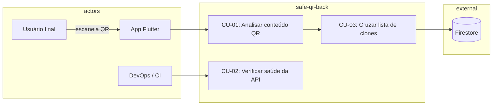

# 04 — Casos de uso

## Atores

| Ator | Descrição |
|------|-----------|
| **Usuário final** | Escaneia QR no app Flutter; não interage diretamente com a API |
| **App Flutter** | Cliente HTTP autenticado (`AuthenticatedAppNetwork`) — analyze e history em modo `remote` |
| **DevOps / CI** | Consulta `GET /v1/health` para smoke tests e monitoramento |
| **Administrador** (futuro) | Gerencia listas de domínios, métricas — **fora do escopo atual** |

## Diagrama de casos de uso

---

## CU-01 — Analisar conteúdo de QR Code

**Ator principal:** App Flutter (em nome do usuário)

**Pré-condições:**

- API acessível na rede (`API_BASE_URL` configurado no app)
- Modo de análise = `remote` no `.env` do app
- Conteúdo do QR já decodificado pela câmera

**Pré-condição adicional:** app autenticado no Firebase (`getIdToken()`).

**Fluxo principal:**

1. App obtém JWT: `await FirebaseAuth.instance.currentUser!.getIdToken()`.
2. App envia `POST /v1/qr/analyze` com header `Authorization: Bearer <JWT>`, `rawContent` e metadados opcionais `client`.
3. API valida o corpo (Zod) e o tamanho em bytes UTF-8.
4. API valida o Bearer (`verifyIdToken`) e resolve `idUser` = `decoded.uid`.
5. API registra log estruturado (tamanho + digest + `idUser`, sem texto bruto).
6. Serviço classifica o conteúdo (heurística + lista Firestore opcional).
7. API responde `200` com `verdict`, `safeToOpen`, `reasons`, `parsed`.
8. API publica evento `qr.analyzed` no Pub/Sub (histórico assíncrono na nuvem).
9. App exibe resultado ao usuário e grava no histórico SQLite local.

**Fluxos alternativos:**

| Código | Condição | Resposta |
|--------|----------|----------|
| E1 | Corpo JSON inválido ou `rawContent` vazio | `400 VALIDATION_ERROR` |
| E2 | `rawContent` excede `MAX_RAW_CONTENT_BYTES` | `413 PAYLOAD_TOO_LARGE` |
| E3 | Bearer ausente, JWT inválido ou expirado | `401 UNAUTHORIZED` |
| E4 | Só `client.idUser` no body, sem Bearer | `401 UNAUTHORIZED` |
| E5 | Erro interno não tratado | `500 INTERNAL_ERROR` |
| E6 | Firestore indisponível | Análise continua sem lista (fail-open) |

**Pós-condições:**

- Usuário recebe veredito e pode decidir abrir/copiar/cancelar
- Log da requisição existe no servidor (sem conteúdo bruto)

---

## CU-02 — Verificar saúde da API

**Ator principal:** DevOps, CI, ou app no bootstrap

**Fluxo:**

1. Cliente envia `GET /v1/health` (ou `GET /health`).
2. API responde `200` com `{ status: "ok", service: "safe-qr-api", version }`.

**Uso no app:** O `dependency_injection.dart` faz GET no health no bootstrap para verificar conectividade.

---

## CU-03 — Cruzar hostname com lista de clones (Firestore)

**Ator:** Sistema (interno ao `QrAnalyzeService`)

**Pré-condições:**

- Credenciais Firebase configuradas no backend
- Documento `suspicious_hosts/clones` existe no Firestore com campo `urls`

**Fluxo:**

1. Serviço extrai hostname da URL http(s) e normaliza (minúsculas, sem `www.`).
2. `FirestoreSuspiciousHostsPort` carrega lista (com cache TTL).
3. Verifica correspondência exata ou subdomínio.
4. Se match → `verdict: unsafe` com motivo de clone/phishing.

**Exceção:** Falha de rede/credencial → ignora lista, segue heurística pura.

---

## Matriz de vereditos por tipo de conteúdo

| Tipo detectado | Exemplo | Veredito típico |
|----------------|---------|-----------------|
| Vazio | `""` | `unknown` |
| Wi‑Fi | `WIFI:...` | `unknown` |
| vCard | `BEGIN:VCARD` | `unknown` |
| HTTPS limpo | `https://example.com` | `safe` |
| HTTPS + sinais | `https://bit.ly/x` | `suspicious` |
| HTTP | `http://site.com` | `suspicious` |
| IP literal | `https://192.168.1.1` | `suspicious` |
| Esquema perigoso | `javascript:alert(1)` | `unsafe` |
| Esquema externo | `mailto:x@y.com` | `suspicious` |
| Host na blocklist | clone de loja | `unsafe` |
| Texto puro | `Olá mundo` | `unknown` |

---

## Requisitos funcionais mapeados

### Backend (RF-B)

| ID | Caso de uso | Implementação |
|----|-------------|---------------|
| RF-B01 | CU-02 | `HealthController.getV1` |
| RF-B02 | CU-01 | `QrAnalyzeController.postAnalyze` |
| RF-B03 | CU-01 | `QrAnalyzeService` + `toQrAnalyzeResponseJson` |
| RF-B04 | CU-01 E1/E2 | Zod + `MAX_RAW_CONTENT_BYTES` |
| RF-B05 | CU-01 passo 3 | `contentDigest` no log Pino |
| RF-B06 | — | Não implementado |

### Requisitos não funcionais (RNF)

| ID | Descrição | Status |
|----|-----------|--------|
| RNF-01 | TLS em produção | Depende do deploy |
| RNF-02 | Privacidade nos logs | ✅ digest, sem rawContent |
| RNF-03 | Resposta < 2s P95 | ✅ heurística leve |
| RNF-04 | Health check | ✅ |
| RNF-05 | Modular + lint | ✅ |
| RNF-06 | Logs JSON + requestId | ✅ |
| RNF-08 | Testes de contrato | ✅ 12 testes Vitest |

---

## Cenários de teste documentados

Os testes em `test/` cobrem os cenários abaixo:

| Cenário | Arquivo | Resultado esperado |
|---------|---------|-------------------|
| HTTPS simples | `qr-analyze.test.ts` | `safe` |
| Encurtador bit.ly | `qr-analyze.test.ts` | `suspicious` |
| `javascript:` | `qr-analyze.test.ts` | `unsafe` |
| Sem Bearer | `qr-analyze.test.ts` | `401` |
| Só `client.idUser` sem Bearer | `qr-analyze.test.ts` | `401` |
| `rawContent` vazio | `qr-analyze.test.ts` | `400` |
| Payload > limite | `qr-analyze.test.ts` | `413` |
| Host na lista mock | `qr-analyze-clones.test.ts` | `unsafe` |
| Host fora da lista | `qr-analyze-clones.test.ts` | `safe` |
| Normalização www | `suspicious-hosts-match.test.ts` | `example.com` |
| Subdomínio na blocklist | `suspicious-hosts-match.test.ts` | match |
| Health v1 e alias | `health.test.ts` | `200 ok` |
