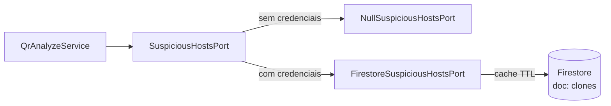

# 07 — Integração Firestore (lista de clones)

O backend pode consultar uma **lista dinâmica de domínios suspeitos** armazenada no Cloud Firestore. Isso permite detectar sites clonados (ex.: `magasineluiza.com.br` imitando `magazineluiza.com.br`) sem redeploy da API.

## Modelo de dados

| Item | Valor |
|------|-------|
| **Coleção** | `suspicious_hosts` |
| **Documento** | `clones` |
| **Campo** | `urls` — array de strings |
| **Formato das entradas** | URL completa ou hostname |

### Exemplo no Firestore Console

```json
// Documento: suspicious_hosts/clones
{
  "urls": [
    "https://magasineluiza.com.br/login",
    "amaz0n.com.br",
    "https://www.paypa1.com"
  ]
}
```

## Arquitetura da integração



## Interface `SuspiciousHostsPort`

```typescript
interface SuspiciousHostsPort {
  isListedHostname(normalizedHost: string): Promise<boolean>;
}
```

### Implementações

| Classe | Quando | Comportamento |
|--------|--------|---------------|
| `NullSuspiciousHostsPort` | Sem credenciais Firebase | Sempre retorna `false` |
| `FirestoreSuspiciousHostsPort` | Com credenciais | Lê Firestore com cache |

## Normalização de hostnames

Funções em `suspicious-hosts-match.ts`:

### `normalizeHostname(host)`

- Converte para minúsculas
- Remove prefixo `www.`

```
WWW.Example.COM → example.com
```

### `listEntryToNormalizedHost(entry)`

Aceita URL completa ou host puro:

```
https://amaz0n.com.br/x  → amaz0n.com.br
evil.com                 → evil.com
```

### `hostnameMatchesBlocklist(host, set)`

- Match **exato** no Set
- Match por **subdomínio**: `pay.bad.com` corresponde a `bad.com`

## Cache em memória

| Config | Variável | Padrão |
|--------|----------|--------|
| TTL do cache | `FIRESTORE_SUSPICIOUS_CACHE_MS` | 60000 (1 min) |
| Máximo | — | 3600000 (1 hora) |

O cache evita leituras excessivas ao Firestore. Após expirar o TTL, a próxima análise recarrega o documento.

## Autenticação (Firebase Admin SDK)

Ordem de inicialização em `ensureFirebaseApp()`:

1. Se app já inicializado → reutiliza
2. Se `FIREBASE_SERVICE_ACCOUNT_JSON` → `cert(parsed)`
3. Senão → `applicationDefault()` (usa `GOOGLE_APPLICATION_CREDENTIALS` ou ADC do ambiente)

### Configuração local (`.env`)

```env
# Opção A — arquivo JSON
GOOGLE_APPLICATION_CREDENTIALS=./safe-qr-app-xxxx.json

# Opção B — JSON inline (CI)
FIREBASE_SERVICE_ACCOUNT_JSON={"type":"service_account",...}

# Cache (opcional)
FIRESTORE_SUSPICIOUS_CACHE_MS=60000
```

### Permissões necessárias na conta de serviço

- **Cloud Datastore User** ou papel equivalente do Firebase Admin SDK
- Acesso de **leitura** ao documento `suspicious_hosts/clones`

## Política fail-open

Se o Firestore falhar (rede, credencial inválida, regras de segurança):

```typescript
catch (err) {
  console.warn('[suspicious_hosts] Firestore indisponível; ignorando lista.', err);
  return false;
}
```

A análise **continua** com heurística pura. O usuário não fica bloqueado por indisponibilidade da nuvem.

## Fluxo na análise

```
URL https://www.magasineluiza.com.br/login
    ↓
normalizeHostname → magasineluiza.com.br
    ↓
isListedHostname (com cache)
    ↓
hostnameMatchesBlocklist?
    SIM → verdict: unsafe
    NÃO → continua httpLike()
```

## Segurança

| Prática | Detalhe |
|---------|---------|
| Credenciais no `.gitignore` | `safe-qr-app-*.json`, `.env` |
| Somente leitura | Backend não escreve no Firestore |
| Sem URL completa nos logs | Apenas digest do conteúdo |

## Testes

| Arquivo | O que testa |
|---------|-------------|
| `suspicious-hosts-match.test.ts` | Normalização e match de subdomínio |
| `qr-analyze-clones.test.ts` | Service com `MockSuspiciousHosts` |

Testes de integração **real** com Firestore não existem (evita dependência de credenciais no CI).

## Gestão da lista (operacional)

Para adicionar um domínio suspeito:

1. Abrir Firebase Console → Firestore
2. Navegar para `suspicious_hosts` → documento `clones`
3. Adicionar entrada no array `urls`
4. Aguardar até `FIRESTORE_SUSPICIOUS_CACHE_MS` para a API refletir (ou reiniciar o processo)

## Evolução futura

- Endpoint admin para CRUD da lista (com auth)
- Múltiplos documentos (phishing, malware, typosquatting)
- Sincronização via Pub/Sub quando lista mudar
- Warm-up do cache no startup
