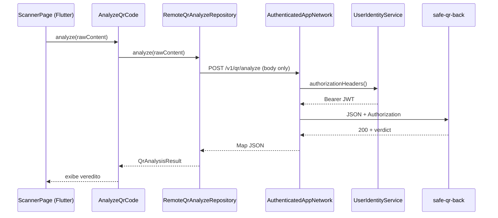

# 10 — Integração com o app mobile (Flutter)

O backend foi projetado como parceiro do app **`safe_qr_app`**. O contrato HTTP é estável e compartilhado entre os dois projetos.

## Visão geral da integração



O Bearer **não** é montado nos repositórios — `AuthenticatedAppNetwork` injeta o header em **todos** os pedidos (`POST`, `GET`, `DELETE`).

## Configuração no app

Arquivo: `safe_qr_app/assets/.env`

| Chave | Descrição | Exemplo |
|-------|-----------|---------|
| `API_BASE_URL` | URL base da API (sem trailing slash) | `http://192.168.1.10:3000` |
| `ANALYZE_MODE` | `local` ou `remote` | `remote` |

Chaves definidas em `lib/core/constants/app_env_keys.dart`.

## Endpoints consumidos

Definidos em `lib/core/constants/app_endpoints.dart`:

```dart
abstract final class AppEndpoints {
  static const String v1Root = '/v1';
  static const String health = '$v1Root/health';       // GET
  static const String qrAnalyze = '$v1Root/qr/analyze'; // POST
  static const String history = '$v1Root/history';      // GET, POST, DELETE
  static String historyItem(String id) => '$history/$id'; // DELETE
}
```

## Autenticação (obrigatória)

`POST /v1/qr/analyze` e CRUD `/v1/history` exigem o **mesmo Bearer**:

```
Authorization: Bearer <Firebase ID Token>
```

| Fonte no app | Uso |
|--------------|-----|
| `UserIdentityService.authorizationHeaders()` | JWT via `AuthenticatedAppNetwork` |
| `client.idUser` no body | ❌ não autentica — app **não envia** |

Sem Bearer a API retorna **`401 UNAUTHORIZED`**.

### Wiring (DI)

`lib/app/di/dependency_injection.dart`:

```dart
..registerLazySingleton<UserIdentityService>(() => UserIdentityService(sl()))
..registerLazySingleton<AppNetwork>(
  () => AuthenticatedAppNetwork(
    inner: DioAppNetwork(dio: sl()),
    identity: sl(),
  ),
)
```

`RemoteQrAnalyzeRepository` e `RemoteHistoryRepository` recebem `AppNetwork` já autenticado.

## Request enviado pelo app (analyze)

Implementação: `RemoteQrAnalyzeRepository` — **sem** header manual.

```dart
await _net.post(
  AppEndpoints.qrAnalyze,
  body: {
    'rawContent': rawContent,
    'client': {
      'appVersion': appVersion ?? AppBuildInfo.versionLabel,
      'platform': platform ?? 'android',
    },
  },
);
```

O `AuthenticatedAppNetwork` adiciona `Authorization: Bearer <token>` automaticamente.

## Response mapeada no app

O JSON da API é deserializado via `QrAnalyzeDto.fromJson()` e convertido para entidade de domínio `QrAnalysisResult` em `QrAnalysisMappers.toDomain()`.

### Campos esperados pelo app

| Campo API | Uso no app |
|-----------|------------|
| `verdict` | Enum `QrSecurityVerdict` |
| `safeToOpen` | Habilita/desabilita botão "Abrir" |
| `reasons` | Lista exibida na tela de resultado |
| `parsed.type` | Ícone / categorização |
| `parsed.scheme` | Detalhe técnico |
| `parsed.host` | Exibição do domínio |
| `requestId` | Correlação (futuro) |

## Modos de análise

| Modo | Quando | Motor | Histórico |
|------|--------|-------|-----------|
| `local` | `ANALYZE_MODE=local` | `LocalHeuristicQrAnalyzeRepository` | SQLite local |
| `remote` | `ANALYZE_MODE=remote` | `RemoteQrAnalyzeRepository` | Firestore via Pub/Sub + `GET /v1/history` |

A heurística remota **espelha** a local (`QrLocalHeuristicEngine` ↔ `QrAnalyzeService`).

### Vantagem do modo remote

- Lista Firestore de clones aplicada server-side
- Atualização de regras sem redeploy do app
- Logs centralizados no servidor
- Histórico na nuvem (sem gravar scan localmente após analyze)

## Health check no bootstrap

`dependency_injection.dart` verifica conectividade (debug):

```dart
await sl<AppNetwork>().get(AppEndpoints.health);
// Log: "Bootstrap: GET {apiBaseUrl}/v1/health OK"
```

O health também passa pelo `AuthenticatedAppNetwork` (Bearer incluído).

## Tratamento de erros no app

| Status API | Comportamento esperado no app |
|------------|-------------------------------|
| `200` | Exibe resultado |
| `401` | Token ausente/inválido — `AppStrings.identityError` |
| `400` | Mensagem de payload inválido |
| `413` | QR muito grande |
| `500` | Erro genérico |
| Timeout / rede | Mensagem amigável (RF-M10) |

Implementado via `DioAppNetwork` → `AppHttpException` / `UserIdentityException` → `QrReaderViewModel`.

## Histórico

| Camada | Onde | Como |
|--------|------|------|
| Local (`ANALYZE_MODE=local`) | SQLite no dispositivo | `HistoryRepositoryImpl` |
| Nuvem (`ANALYZE_MODE=remote`) | Firestore `history/{uid}/items/{id}` | Pub/Sub `qr.analyzed` após analyze 200 + Bearer |

| Operação | Quem faz |
|----------|----------|
| Scan → analyze | App (`POST /v1/qr/analyze` + Bearer) — **sem** INSERT local |
| Gravar scan | Back + `safe_qr_messaging` (`consume:history`) |
| Listar / apagar | App (`RemoteHistoryRepository` + Bearer) |
| QR gerado | App (`POST /v1/history` + Bearer) |

Ver [12-api-historico.md](./12-api-historico.md) e [13-pubsub-qr-analyzed.md](./13-pubsub-qr-analyzed.md).

## Firebase — papéis distintos

| Componente | SDK | Papel |
|------------|-----|-------|
| App Flutter | `firebase_auth` | Sessão anónima → `getIdToken()` → Bearer |
| App Flutter | `firebase_core` | Inicialização |
| Backend | `firebase-admin` | `verifyIdToken`, blocklist, histórico Firestore |
| `safe_qr_messaging` | `firebase-admin` | Consumidor Pub/Sub → Firestore |

## Testar integração manualmente

1. Subir backend: `cd safe_qr_back && npm run dev`
2. Subir consumidor: `cd safe_qr_messaging && npm run consume:history`
3. Descobrir IP: `ipconfig` (Windows) ou `ip a`
4. Configurar app: `API_BASE_URL=http://<IP>:3000`, `ANALYZE_MODE=remote`
5. Rebuild Flutter; garantir Firebase Anonymous ativo no Console
6. Escanear QR → log back `event: qr_analyze` com `idUser`
7. Aba Histórico → pull-to-refresh → item aparece via `GET /v1/history`

Documentação app: [`../../safe_qr_app/docs/07-api-integracao.md`](../../safe_qr_app/docs/07-api-integracao.md)

## Compatibilidade de versões

| Backend | App | Notas |
|---------|-----|-------|
| 0.1.0 | Sprint 2+ | Bearer obrigatório em analyze e history |
| Futuro `/v2` | — | Manter `/v1` enquanto app antigo em uso |

## Checklist para mudanças no contrato

Ao alterar a API, atualizar **simultaneamente**:

- [ ] `src/schemas/qr-analyze.schema.ts` (backend)
- [ ] `src/views/qr-analyze-response.view.ts` (backend)
- [ ] `QrAnalyzeDto` / mappers (Flutter)
- [ ] `test/qr-analyze.test.ts` (backend)
- [ ] `AuthenticatedAppNetwork` / repositórios (se auth mudar)
- [ ] `safe_qr_app/docs/07-api-integracao.md` e esta documentação
