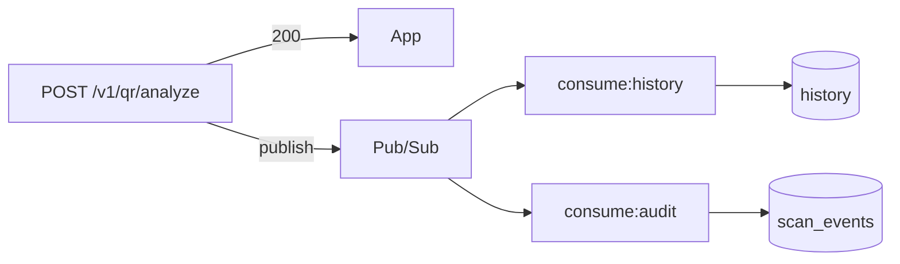

# 11 — Roadmap e evolução

Documento de planejamento baseado no estado atual do código e nos docs de sprint do monorepo.

## Estado atual (v0.1.0)

| Capacidade | Status |
|------------|--------|
| Health check | ✅ Completo |
| Análise heurística QR | ✅ Completo (S1) |
| Lista Firestore clones | ✅ Completo |
| Google Safe Browsing | ✅ Completo (API v4, fail-open) |
| Logs com privacidade | ✅ Completo |
| Testes automatizados | ✅ 31+ testes |
| CRUD histórico `/v1/history` | ✅ Firestore |
| Autenticação Firebase JWT | ✅ analyze + history |
| Pub/Sub mensageria | ✅ Produtor + fan-out consumidores |
| Deploy Cloud Run (API) | ✅ `safe-qr-api` em `southamerica-east1` |
| Deploy workers Cloud Run | ✅ `safe-qr-worker-history` + `safe-qr-worker-audit` |

## Gaps vs. checklist acadêmico (Sprint 2)

Referência: [`../../docs/SPRINT-2-STATUS-E-PROXIMA-ENTREGA.md`](../../docs/SPRINT-2-STATUS-E-PROXIMA-ENTREGA.md)

| Exigência | Gap | Proposta |
|-----------|-----|----------|
| CRUD básico no back | Sem endpoints CRUD | `POST/GET /v1/scan-events` em Firestore ou PostgreSQL |
| BD servidor + seed | Só blocklist Firestore | Seed de `demo_items` ou `scan_events` |
| Nuvem + doc | Firebase parcial | Deploy Cloud Run + URL pública |
| Evidências | Docs técnicos | Prints Postman, Firebase, app |

## Roadmap por sprint

### Sprint 2 (curto prazo)

**Objetivo:** Fechar checklist acadêmico sem quebrar contrato existente.

1. **CRUD mínimo**
   - `POST /v1/scan-events` — registrar evento agregado (sem URL completa)
   - `GET /v1/scan-events` — listar últimos N eventos
   - Persistência: Firestore coleção `scan_events` ou PostgreSQL

2. **Seed de dados**
   - Script `npm run seed` com 10–20 registros de teste

3. **Deploy**
   - Cloud Run com health check
   - Documentar URL em `08-configuracao-deploy.md`

4. **Hardening**
   - CORS restrito ao domínio do app
   - `@fastify/rate-limit` básico

### Sprint 3 — Mensageria (Pub/Sub) — **implementado**

**Objetivo:** Eventos assíncronos pós-análise + histórico na fila.



**Docs:** [13-pubsub-qr-analyzed.md](./13-pubsub-qr-analyzed.md), [safe_qr_workers/docs/02-FANOUT-HISTORICO-AUDIT.md](../../safe_qr_workers/docs/02-FANOUT-HISTORICO-AUDIT.md).

**Próximo:** `GET /v1/scan-events` (listar auditoria no app).

<details>
<summary>Payload original planejado (referência)</summary>

4. Após resposta 200, publicar mensagem:

```json
{
  "requestId": "...",
  "timestamp": "ISO-8601",
  "verdict": "safe",
  "safeToOpen": true,
  "contentDigest": "abc123...",
  "host": "example.com"
}
```

5. Consumidor demo: `npm run pubsub:listen` ou Cloud Function push

**Privacidade:** Não incluir `rawContent` na mensagem — usar digest existente.

</details>

### Sprint 4+ (médio prazo)

| Feature | Descrição | Prioridade |
|---------|-----------|------------|
| Typosquatting avançado | Homoglyphs automáticos (blocklist por palavra-chave já cobre typos comuns) | Should |
| Resolução redirects | HEAD request controlado em encurtadores (Safe Browsing já cobre reputação global) | Could |
| Auth API | API key ou Firebase Auth | Should |
| Admin panel | Painel `safe_qr_web` — eventos, blocklist, paginação | ✅ Feito |
| Métricas | Prometheus / Cloud Monitoring | Could |
| Cache Redis | Blocklist distribuída | Could |
| OpenAPI | Swagger / Scalar em `/docs` | Should |

## Melhorias técnicas identificadas

### Alta prioridade

| Item | Motivo |
|------|--------|
| Unificar `requestId` HTTP e body | Confusão na correlação |
| Rate limiting | Proteção em produção |
| CORS restrito | Segurança |
| CI GitHub Actions | Qualidade contínua |

### Média prioridade

| Item | Motivo |
|------|--------|
| OpenAPI spec | Documentação viva |
| Firestore emulator nos testes | CI sem credenciais |
| Graceful shutdown | SIGTERM no Cloud Run |
| Helmet / security headers | Hardening HTTP |

### Baixa prioridade

| Item | Motivo |
|------|--------|
| Migrar para monorepo tooling (turbo) | Só se escala justificar |
| GraphQL | REST suficiente para MVP |

## Versionamento da API

Estratégia recomendada:

- Manter `/v1` estável enquanto app em produção
- Breaking changes → `/v2` com período de depreciação
- Header `Accept-Version: v1` (opcional, futuro)

## Débitos técnicos conhecidos

| Débito | Impacto | Esforço |
|--------|---------|---------|
| Dois `requestId` diferentes | Debug confuso | Baixo |
| `console.warn` no Firestore fail-open | Deveria usar Pino | Baixo |
| CORS aberto | Risco em produção | Baixo |
| Sem OpenAPI | Integração manual | Médio |
| Heurística duplicada (Flutter + Node) | Drift entre modos | Médio — considerar lib compartilhada ou só remote |

## KPIs sugeridos (pós-deploy)

| Métrica | Meta |
|---------|------|
| Latência P95 analyze | < 2s |
| Disponibilidade | > 99% (Cloud Run) |
| Taxa de erro 5xx | < 0.1% |
| Cache hit rate blocklist | > 95% |

## Contatos e ownership

| Área | Responsável sugerido |
|------|---------------------|
| API / heurística | Backend lead |
| Firestore / GCP | DevOps / cloud |
| Contrato mobile | Mobile lead |
| Documentação | Todos (PRs atualizam `docs/`) |

---

*Atualizar este documento após cada sprint com datas, URLs de deploy e nomes de tópicos Pub/Sub.*
