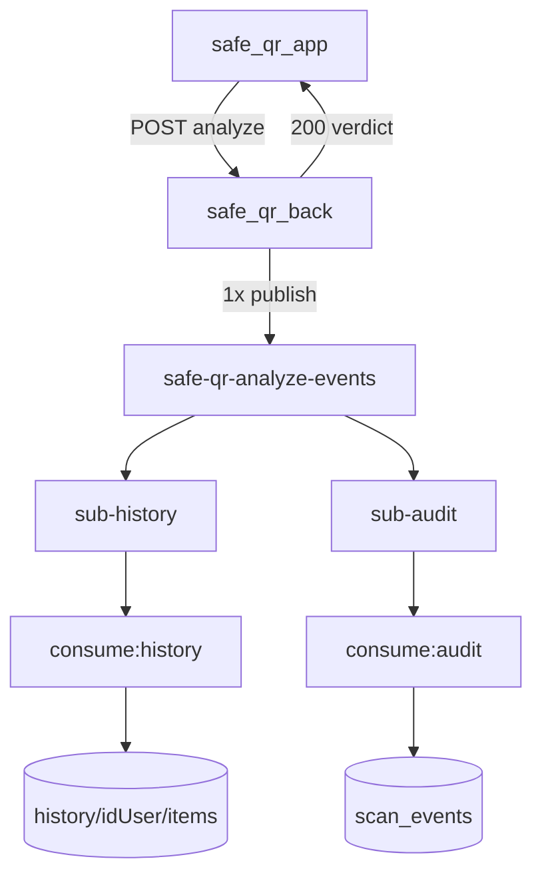

# safe_qr_workers

Consumidores **Google Cloud Pub/Sub** do projeto **Safe QR** (fan-out). A API publica **uma vez**; dois processos gravam **histórico do usuário** e **auditoria** (`scan_events`).

> Pasta `safe_qr_workers` (package npm: `safe-qr-messaging`). Em produção: Cloud Run `safe-qr-worker-history` + `safe-qr-worker-audit`.

---

## Papel no ecossistema



| Componente | Responsabilidade |
|------------|------------------|
| `safe_qr_app` | Scan → analyze; histórico via `GET /v1/history` |
| `safe_qr_back` | Responde na hora + publica evento com `historyItem` |
| **`consume:history`** | Grava `history/{idUser}/items/{id}` |
| **`consume:audit`** | Grava `scan_events/{eventId}` |

---

## Infraestrutura GCP (projeto `safe-qr-app`)

| Recurso | Nome |
|---------|------|
| Tópico | `safe-qr-analyze-events` |
| Subscription audit | `safe-qr-analyze-events-sub` (existente) |
| Subscription history | **`safe-qr-analyze-events-sub-history`** (criar no GCP) |
| Firestore histórico | `history/{idUser}/items/{id}` |
| Firestore auditoria | `scan_events/{eventId}` |

### Criar subscription de histórico (manual, 1x)

1. [Pub/Sub → Tópicos](https://console.cloud.google.com/cloudpubsub/topic/list) → `safe-qr-analyze-events`
2. **Criar assinatura** → ID: `safe-qr-analyze-events-sub-history`
3. Tipo: **Pull**, ack 60s, sem extras (schema/BigQuery desmarcados)

Setup manual detalhado: **[docs/01-PUBSUB-IMPLEMENTACAO.md](./docs/01-PUBSUB-IMPLEMENTACAO.md)**

---

## Pré-requisitos

- **Node.js ≥ 20**
- Conta de serviço **consumer** com chave JSON (não commitar)
- SA com **`pubsub.subscriber`** e **`Cloud Datastore User`** (escrita Firestore)
- Tópico e subscription criados no GCP
- API `safe_qr_back` com `PUBSUB_ENABLED=true` publicando no mesmo tópico

---

## Setup local

```bash
cd safe_qr_workers
cp .env.example .env
npm install
```

Coloque a chave da SA consumidor em:

```
credentials/safe-qr-pubsub-consumer.json
```

Exemplo `.env`:

```env
GCP_PROJECT_ID=safe-qr-app
GOOGLE_APPLICATION_CREDENTIALS=./credentials/safe-qr-pubsub-consumer.json
PUBSUB_SUBSCRIPTION=safe-qr-analyze-events-sub
FIRESTORE_ENABLED=true
FIRESTORE_COLLECTION=scan_events
FIREBASE_GOOGLE_APPLICATION_CREDENTIALS=./credentials/safe-qr-pubsub-consumer.json
CONSUMER_ENABLED=true
LOG_LEVEL=info
```

### IAM — adicionar Firestore na SA consumer

No [Console IAM](https://console.cloud.google.com/iam-admin/iam) → conta `safe-qr-pubsub-consumer@...` → **Conceder acesso** → role **`Cloud Datastore User`**.

Ou via gcloud:

```bash
gcloud projects add-iam-policy-binding safe-qr-app \
  --member="serviceAccount:safe-qr-pubsub-consumer@safe-qr-app.iam.gserviceaccount.com" \
  --role="roles/datastore.user"
```

Reinicie o consumidor após alterar a role (pode levar ~1 min para propagar).

---

## Comandos

| Comando | Descrição |
|---------|-----------|
| `npm run consume:history` | Consumidor histórico local (`sub-history`) |
| `npm run consume:audit` | Consumidor auditoria local (`scan_events`) |
| `npm run consume:events` | Alias de `consume:audit` |
| `npm run build` | Compila para `dist/` (Cloud Run) |
| `.\scripts\deploy-cloud-run.ps1` | Deploy **history + audit** no Cloud Run |
| `npm test` | Testes unitários |

### Produção (Cloud Run)

```powershell
cd safe_qr_workers
.\scripts\deploy-cloud-run.ps1
```

Serviços: `safe-qr-worker-history`, `safe-qr-worker-audit`. Detalhes: **[docs/deploy-cloud-run.md](./docs/deploy-cloud-run.md)**.

---

## Teste ponta a ponta

**Terminal 1 — histórico:**

```bash
npm run consume:history
```

**Terminal 1b — auditoria (opcional):**

```bash
npm run consume:audit
```

**Terminal 2 — API:**

```bash
cd ../safe_qr_back
npm run dev
```

**Terminal 3 — simular analyze:**

```bash
curl -s -X POST http://localhost:3000/v1/qr/analyze \
  -H "Content-Type: application/json" \
  -H "Authorization: Bearer test:firebaseUidDeTeste" \
  -d '{
    "rawContent": "https://example.com",
    "client": { "platform": "android", "appVersion": "1.0.0" }
  }'
```

**Esperado no `consume:history`:** log `qr_analyzed_history_consumed` com `firestore.result: "created"`.

**Esperado no Firestore:** `history/{idUser}/items/{eventId}` — o app lista via `GET /v1/history`.

---

## Contrato do evento (`qr.analyzed`)

Publicado pelo `safe_qr_back` após HTTP 200. Exemplo:

```json
{
  "schemaVersion": "1",
  "eventId": "uuid-v4",
  "eventType": "qr.analyzed",
  "occurredAt": "2026-06-08T20:15:30.123Z",
  "source": "safe-qr-api",
  "correlationId": "request-id-http",
  "data": {
    "idUser": "Vb3ubOjy9RYt9AKpx3VzunBirEc2",
    "contentDigest": "a1b2c3d4e5f67890",
    "rawByteLength": 42,
    "verdict": "safe",
    "safeToOpen": true,
    "reasonCodes": ["HTTPS_OK"],
    "reasonsCount": 1,
    "parsed": { "type": "url", "scheme": "https", "host": "example.com" },
    "client": { "platform": "android", "appVersion": "1.0.0" },
    "analysisDurationMs": 85,
    "historyItem": {
      "id": "uuid-v4",
      "type": "scan",
      "content": "https://example.com",
      "createdAtMs": 1717881330123,
      "verdict": "safe",
      "safeToOpen": true,
      "reasons": ["HTTPS OK"]
    }
  }
}
```

**Privacidade:** `contentDigest` + hash na auditoria; `historyItem.content` (truncado 2000 chars) só no payload para o consumidor de histórico.

Validação: `src/schemas/qr-analyzed.schema.ts` (Zod).

---

## Estrutura do código

```
safe_qr_workers/
├── credentials/                 # .gitignore — JSON da SA
├── docs/
│   └── 01-PUBSUB-IMPLEMENTACAO.md
├── scripts/
│   ├── consume-history.ts
│   ├── consume-audit.ts
│   └── run-consumer.ts
├── src/
│   ├── handlers/
│   │   ├── qr-analyzed-history.handler.ts
│   │   └── qr-analyzed-audit.handler.ts
│   ├── repositories/ (history + scan_events)
│   └── services/pubsub-subscriber.service.ts
└── test/
```

### Fluxo interno

1. `PubSubSubscriberService` — pull da subscription (history ou audit)
2. Parse JSON + validação Zod
3. Dedupe `eventId` em memória (at-least-once)
4. Handler grava Firestore + log (Pino)
5. `ack` em sucesso; `nack` em erro

### Firestore

**Histórico** (`consume:history`): `history/{idUser}/items/{id}`

**Auditoria** (`consume:audit`): `scan_events/{eventId}`

| Campo | Descrição |
|-------|-----------|
| `eventId` | UUID (também ID do documento — idempotente) |
| `idUser` | Usuário anônimo do app |
| `verdict` | safe / suspicious / unsafe / unknown |
| `contentDigest` | Hash do conteúdo (sem URL completa) |
| `host` | Em `parsed.host` |
| `occurredAt` | Quando a API analisou |
| `consumedAt` | Quando o consumidor gravou |

---

## Variáveis de ambiente

| Variável | Obrigatória | Default | Descrição |
|----------|-------------|---------|-----------|
| `GCP_PROJECT_ID` | Sim | — | ID do projeto GCP |
| `GOOGLE_APPLICATION_CREDENTIALS` | Sim (local) | — | Caminho para JSON da SA consumer |
| `PUBSUB_SUBSCRIPTION_AUDIT` | Não | `safe-qr-analyze-events-sub` | Subscription auditoria |
| `PUBSUB_SUBSCRIPTION_HISTORY` | Não | `safe-qr-analyze-events-sub-history` | Subscription histórico |
| `CONSUMER_ENABLED` | Não | `true` | Liga/desliga consumidor |
| `CONSUMER_MAX_MESSAGES` | Não | `10` | Flow control |
| `CONSUMER_ACK_DEADLINE_SEC` | Não | `60` | Referência documental |
| `FIRESTORE_ENABLED` | Não | `true` | Grava eventos no Firestore |
| `FIRESTORE_COLLECTION` | Não | `scan_events` | Coleção destino |
| `FIREBASE_GOOGLE_APPLICATION_CREDENTIALS` | Não | fallback `GOOGLE_APPLICATION_CREDENTIALS` | JSON da SA com acesso Firestore |
| `FIREBASE_SERVICE_ACCOUNT_JSON` | Não | — | JSON inline (CI/PaaS) |
| `LOG_LEVEL` | Não | `info` | Nível Pino |

---

## Segurança

- **Nunca** commitar `credentials/*.json` ou `.env`
- SA consumer: `pubsub.subscriber` + `datastore.user` (least privilege para o que o módulo faz)
- Chaves rotacionar se expostas acidentalmente

---

## Evolução planejada

| Fase | Item |
|------|------|
| Back | `GET /v1/scan-events` (listar auditoria) |
| Tópico 2 | `safe-qr-blocklist-updates` (consumidor separado) |
| Opcional | Dead-letter topic + subscription |
| ✅ | Cloud Run `safe-qr-worker-history` + `safe-qr-worker-audit` — ver [docs/deploy-cloud-run.md](./docs/deploy-cloud-run.md) |

---

## Repositórios relacionados

```
safe-qr-mobile/
├── safe_qr_app/          # Flutter — Bearer JWT + scan
├── safe_qr_back/         # API — produtor Pub/Sub
└── safe_qr_workers/      # Este repo — consumidor
```

---

## Documentação

- **[docs/02-FANOUT-HISTORICO-AUDIT.md](./docs/02-FANOUT-HISTORICO-AUDIT.md)** — fan-out (histórico + auditoria)
- **[docs/01-PUBSUB-IMPLEMENTACAO.md](./docs/01-PUBSUB-IMPLEMENTACAO.md)** — setup GCP, IAM, contratos
- `safe_qr_back/docs/` — API e endpoints
- `safe_qr_app/docs/07-api-integracao.md` — integração mobile

---

**Versão:** 0.3.0 · **Stack:** Node 20, TypeScript, `@google-cloud/pubsub`, `firebase-admin`, Zod, Pino
