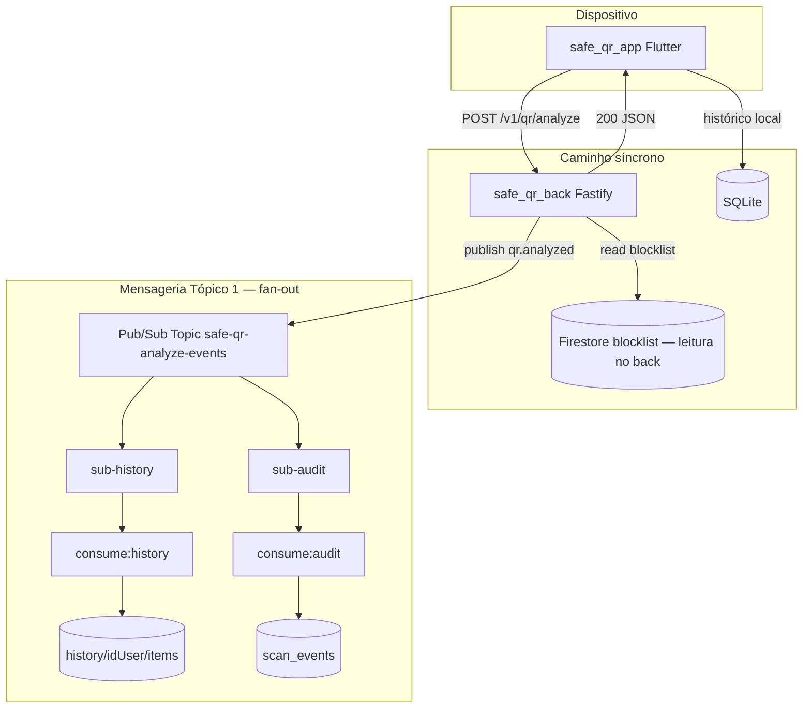
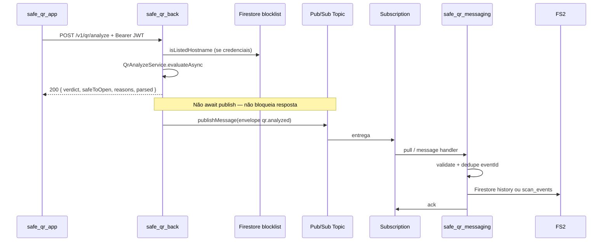

# 01 — Pub/Sub Safe QR: especificação técnica de implementação

**Repositório:** `safe_qr_workers` (antes `safe_qr_messaging`)  
**Versão do documento:** 1.3  
**Data:** junho de 2026  
**Escopo:** Tópico 1 — eventos de análise (`qr.analyzed`). Fan-out com **dois consumidores** (histórico + auditoria).

> **Produção:** Cloud Run `safe-qr-worker-history` + `safe-qr-worker-audit` — [deploy-cloud-run.md](./deploy-cloud-run.md).  
> **Fluxo:** [02-FANOUT-HISTORICO-AUDIT.md](./02-FANOUT-HISTORICO-AUDIT.md).

---

## Índice

1. [Visão geral](#1-visão-geral)
2. [Arquitetura](#2-arquitetura)
3. [Pré-requisitos GCP](#3-pré-requisitos-gcp)
4. [Passo a passo manual — Console GCP](#4-passo-a-passo-manual--console-gcp)
5. [Passo a passo manual — Service Accounts e credenciais](#5-passo-a-passo-manual--service-accounts-e-credenciais)
6. [Passo a passo manual — gcloud CLI (alternativa)](#6-passo-a-passo-manual--gcloud-cli-alternativa)
7. [IAM — matriz de permissões](#7-iam--matriz-de-permissões)
8. [Configuração local — variáveis de ambiente](#8-configuração-local--variáveis-de-ambiente)
9. [Contrato de eventos (Tópico 1)](#9-contrato-de-eventos-tópico-1)
10. [Mapeamento `reasonCodes`](#10-mapeamento-reasoncodes)
11. [Fluxo `idUser`](#11-fluxo-iduser)
12. [Estrutura do repositório `safe_qr_messaging`](#12-estrutura-do-repositório-safe_qr_messaging)
13. [Integração em `safe_qr_back` (produtor)](#13-integração-em-safe_qr_back-produtor)
14. [Integração em `safe_qr_app` (origem do idUser)](#14-integração-em-safe_qr_app-origem-do-iduser)
15. [Implementação do consumidor](#15-implementação-do-consumidor)
16. [Semântica de entrega: ack, nack, retry, DLQ](#16-semântica-de-entrega-ack-nack-retry-dlq)
17. [Desenvolvimento e testes](#17-desenvolvimento-e-testes)
18. [Checklist de implementação por fase](#18-checklist-de-implementação-por-fase)
19. [Troubleshooting](#19-troubleshooting)
20. [Segurança e privacidade](#20-segurança-e-privacidade)
21. [Tópico 2 (futuro) — blocklist](#21-tópico-2-futuro--blocklist)
22. [Referências](#22-referências)

---

## 1. Visão geral

### 1.1 Problema

O endpoint `POST /v1/qr/analyze` responde de forma **síncrona** ao app. Emitir eventos de domínio (auditoria, estatísticas, integrações futuras) **não deve** aumentar a latência percebida pelo usuário.

### 1.2 Solução

| Papel | Componente | Responsabilidade |
|-------|------------|------------------|
| Produtor | `safe_qr_back` | Após HTTP 200 + Bearer, publica envelope com `historyItem` (**fire-and-forget**) |
| Broker | Google Cloud Pub/Sub | 1 tópico, fan-out para 2 subscriptions |
| Consumidor histórico | `consume:history` | Grava `history/{idUser}/items/{id}` |
| Consumidor auditoria | `consume:audit` | Grava `scan_events/{eventId}` |

### 1.3 Fora de escopo deste módulo

- Publicação automática na blocklist (Tópico 2 — ver [§21](#21-tópico-2-futuro--blocklist))
- `GET /v1/history` (fica no `safe_qr_back`)
- Resposta HTTP síncrona do analyze (fica no back)

### 1.4 Nomenclatura fixa (não alterar sem versionar schema)

| Recurso GCP | Nome |
|-------------|------|
| Tópico | `safe-qr-analyze-events` |
| Subscription auditoria | `safe-qr-analyze-events-sub` |
| Subscription histórico | `safe-qr-analyze-events-sub-history` |
| Subscription DLQ (opcional fase 2) | `safe-qr-analyze-events-dlq-sub` |
| Dead-letter topic (opcional) | `safe-qr-analyze-events-dlq` |

---

## 2. Arquitetura

### 2.1 Diagrama de componentes



### 2.2 Sequência temporal



### 2.3 Princípios de design

1. **Resposta HTTP primeiro** — `reply.send()` antes do publish; publish com `.catch()` (fire-and-forget).
2. **At-least-once** — consumidor **idempotente** em memória por `eventId` (log + ack se duplicata).
3. **Privacidade** — payload contém `contentDigest` (SHA-256 truncado), nunca URL completa.
4. **Separação de repos** — consumo/log em `safe_qr_messaging`; produtor em `safe_qr_back`; persistência em banco em outro escopo.
5. **Feature flag** — `PUBSUB_ENABLED=false` desliga publish sem quebrar API.

---

## 3. Pré-requisitos GCP

| Item | Requisito |
|------|-----------|
| Projeto Google Cloud | O **mesmo** projeto Firebase já usado pelo Safe QR |
| Billing | Conta de faturamento ativa (Pub/Sub tem free tier generoso) |
| Ferramentas locais | Node.js ≥ 20, npm, [Google Cloud SDK](https://cloud.google.com/sdk/docs/install) (`gcloud`) opcional |
| Acesso IAM | Permissão para criar SA, tópicos e atribuir roles (Owner ou Editor + IAM Admin) |

### 3.1 Identificar o Project ID

1. Abra [Firebase Console](https://console.firebase.google.com/)
2. Selecione o projeto Safe QR
3. **Configurações do projeto** (engrenagem) → **Geral**
4. Anote:
   - **ID do projeto** → ex.: `safe-qr-app-xxxxx` (usado em env `GCP_PROJECT_ID`)
   - **Número do projeto** → usado em IAM

---

## 4. Passo a passo manual — Console GCP

### 4.1 Ativar a API Cloud Pub/Sub

1. Acesse [Google Cloud Console](https://console.cloud.google.com/)
2. Selecione o **projeto Firebase** do Safe QR (seletor no topo)
3. Barra de busca → digite **`Pub/Sub`** → abra o serviço  
   *(ou: ☰ → **Integração** → **Pub/Sub** — não confundir com "Integration Services")*
4. Se solicitado, ative a **Cloud Pub/Sub API**

**Verificação:** APIs e serviços → **APIs e serviços ativados** → listar `Cloud Pub/Sub API`.

### 4.2 Criar o tópico `safe-qr-analyze-events`

1. Pub/Sub → **Tópicos** → **Criar tópico**
2. Preencha:
   - **ID do tópico:** `safe-qr-analyze-events`
   - **Add a default subscription:** **desmarcado**
   - **Use a schema / ingestion / retention / BigQuery / Cloud Storage / Transforms:** desmarcados
   - **Criptografia:** Google-managed encryption key (padrão)
3. **Criar**

**Anotar:** nome completo do recurso:

```
projects/<GCP_PROJECT_ID>/topics/safe-qr-analyze-events
```

### 4.3 Criar subscription pull `safe-qr-analyze-events-sub`

1. Pub/Sub → **Assinaturas** → **Criar assinatura**
2. Preencha:
   - **ID da assinatura:** `safe-qr-analyze-events-sub`
   - **Selecionar tópico:** `safe-qr-analyze-events`
   - **Tipo de entrega:** **Pull**
   - **Acknowledgement deadline:** `60` segundos
   - **Persistência de mensagem:** Ativada (padrão)
   - **Exatamente uma vez:** Desativado (padrão; dedupe no consumidor)
   - **Tempo de expiração da assinatura:** Never expire
3. **Criar**

### 4.4 (Opcional — Fase 2) Dead-letter topic + subscription

1. Criar tópico: `safe-qr-analyze-events-dlq`
2. Editar subscription `safe-qr-analyze-events-sub`:
   - **Dead lettering:** Enable
   - **Maximum delivery attempts:** `5`
   - **Dead-letter topic:** `safe-qr-analyze-events-dlq`
3. Criar subscription pull na DLQ: `safe-qr-analyze-events-dlq-sub` (inspeção manual)

### 4.5 Verificação visual

| Recurso | Deve existir |
|---------|--------------|
| Tópico | `safe-qr-analyze-events` |
| Subscription | `safe-qr-analyze-events-sub` → ligada ao tópico acima |
| Métricas | Abas **Utilização** / **Métricas** sem erro de permissão |

---

## 5. Passo a passo manual — Service Accounts e credenciais

### 5.1 Estratégia recomendada: duas contas de serviço

| Service Account | Usado por | Motivo |
|-----------------|-----------|--------|
| `safe-qr-pubsub-publisher` | `safe_qr_back` | Só publica no tópico |
| `safe-qr-pubsub-consumer` | `safe_qr_messaging` | Só assina (pull + ack) |

**Alternativa MVP:** reutilizar conta Firebase existente adicionando roles Pub/Sub — ver [§5.5](#55-alternativa-reutilizar-conta-existente).

### 5.2 Criar SA `safe-qr-pubsub-publisher`

1. Console → **IAM e administrador** → **Contas de serviço**
2. **Criar conta de serviço**
3. **Nome:** `safe-qr-pubsub-publisher`
4. **Conceder acesso (roles):** `Pub/Sub Publisher` (`roles/pubsub.publisher`)
5. **Concluir**

#### Chave JSON para desenvolvimento local (`safe_qr_back`)

1. Conta `safe-qr-pubsub-publisher` → **Chaves** → **Adicionar chave** → **JSON**
2. Salvar:

```
safe_qr_back/credentials/safe-qr-pubsub-publisher.json
```

3. **Nunca commitar** — `.gitignore`:

```gitignore
credentials/
*-pubsub-*.json
safe-qr-app-*.json
```

4. No `.env` do back:

```env
GOOGLE_APPLICATION_CREDENTIALS=./credentials/safe-qr-pubsub-publisher.json
GCP_PROJECT_ID=safe-qr-app-xxxxx
PUBSUB_ENABLED=true
PUBSUB_TOPIC=safe-qr-analyze-events
```

> Se o back **também** lê blocklist Firestore, a SA precisa **adicionalmente** `Cloud Datastore User` — ver [§5.5](#55-alternativa-reutilizar-conta-existente).

### 5.3 Criar SA `safe-qr-pubsub-consumer`

1. **Criar conta de serviço** → Nome: `safe-qr-pubsub-consumer`
2. Roles:
   - `Pub/Sub Subscriber` (`roles/pubsub.subscriber`)
   - **Ou** reutilizar JSON Firebase do back para Firestore (`FIREBASE_GOOGLE_APPLICATION_CREDENTIALS`)
3. **Concluir**

> Para gravar Firestore com a mesma SA consumer, adicionar `Cloud Datastore User`. Alternativa: credencial Firebase separada no `.env` (ver README).

#### Chave JSON para desenvolvimento local (`safe_qr_messaging`)

1. Conta `safe-qr-pubsub-consumer` → **Chaves** → JSON
2. Salvar:

```
safe_qr_messaging/credentials/safe-qr-pubsub-consumer.json
```

3. `.env` do messaging:

```env
GOOGLE_APPLICATION_CREDENTIALS=./credentials/safe-qr-pubsub-consumer.json
GCP_PROJECT_ID=safe-qr-app-xxxxx
PUBSUB_SUBSCRIPTION=safe-qr-analyze-events-sub
CONSUMER_ENABLED=true
```

### 5.4 Permissão refinada no tópico/subscription (opcional)

- Tópico `safe-qr-analyze-events` → **Permissões** → publisher SA
- Subscription `safe-qr-analyze-events-sub` → **Permissões** → consumer SA

### 5.5 Alternativa: reutilizar conta existente

Se já existe `safe-qr-app-xxxxx.json` com Firebase Admin (blocklist no back):

1. Adicionar role `Pub/Sub Publisher` para publish no back
2. Criar SA separada **só** para consumer (recomendado) ou adicionar `Pub/Sub Subscriber` na mesma conta
3. Produção (Cloud Run): ADC / Workload Identity — sem JSON no disco

### 5.6 Application Default Credentials (ADC) — produção

Em Cloud Run / GCE:

1. Back → conta `safe-qr-pubsub-publisher@...`
2. Consumer → conta `safe-qr-pubsub-consumer@...`
3. Remover `GOOGLE_APPLICATION_CREDENTIALS` em produção

### 5.7 Checklist de credenciais

- [ ] JSON publisher salvo fora do Git
- [ ] JSON consumer salvo fora do Git
- [ ] `GCP_PROJECT_ID` anotado em `.env.example`
- [ ] `.gitignore` cobre `credentials/`
- [ ] Nenhuma chave em chat, e-mail ou vídeo de demo

---

## 6. Passo a passo manual — gcloud CLI (alternativa)

Substitui §4 e §5 se preferir terminal. Troque `PROJECT_ID` pelo ID real.

```bash
gcloud auth login
gcloud config set project PROJECT_ID

gcloud services enable pubsub.googleapis.com

gcloud pubsub topics create safe-qr-analyze-events

gcloud pubsub subscriptions create safe-qr-analyze-events-sub \
  --topic=safe-qr-analyze-events \
  --ack-deadline=60

gcloud pubsub subscriptions create safe-qr-analyze-events-sub-history \
  --topic=safe-qr-analyze-events \
  --ack-deadline=60

gcloud iam service-accounts create safe-qr-pubsub-publisher \
  --display-name="Safe QR Pub/Sub Publisher"

gcloud projects add-iam-policy-binding PROJECT_ID \
  --member="serviceAccount:safe-qr-pubsub-publisher@PROJECT_ID.iam.gserviceaccount.com" \
  --role="roles/pubsub.publisher"

gcloud iam service-accounts keys create ./safe-qr-pubsub-publisher.json \
  --iam-account=safe-qr-pubsub-publisher@PROJECT_ID.iam.gserviceaccount.com

gcloud iam service-accounts create safe-qr-pubsub-consumer \
  --display-name="Safe QR Pub/Sub Consumer"

gcloud projects add-iam-policy-binding PROJECT_ID \
  --member="serviceAccount:safe-qr-pubsub-consumer@PROJECT_ID.iam.gserviceaccount.com" \
  --role="roles/pubsub.subscriber"

gcloud iam service-accounts keys create ./safe-qr-pubsub-consumer.json \
  --iam-account=safe-qr-pubsub-consumer@PROJECT_ID.iam.gserviceaccount.com
```

### 6.1 Teste manual de publish (sanidade)

```bash
gcloud pubsub topics publish safe-qr-analyze-events \
  --message='{"eventType":"ping","schemaVersion":"1"}'
```

```bash
gcloud pubsub subscriptions pull safe-qr-analyze-events-sub \
  --auto-ack \
  --limit=1
```

---

## 7. IAM — matriz de permissões

| Principal | Role | Escopo | Finalidade |
|-----------|------|--------|------------|
| `safe-qr-pubsub-publisher@...` | `roles/pubsub.publisher` | project ou topic | Publicar eventos |
| `safe-qr-pubsub-publisher@...` | `roles/datastore.user` | project | *(Opcional — só se mesma SA lê blocklist no back)* |
| `safe-qr-pubsub-consumer@...` | `roles/pubsub.subscriber` | project ou subscription | Pull/ack mensagens |
| Desenvolvedor humano | `roles/pubsub.viewer` | project | Debug Console (opcional) |

---

## 8. Configuração local — variáveis de ambiente

### 8.1 `safe_qr_back/.env` (produtor)

```env
PORT=3000
NODE_ENV=development
LOG_LEVEL=info
MAX_RAW_CONTENT_BYTES=8192
GOOGLE_APPLICATION_CREDENTIALS=./credentials/safe-qr-app-combined.json
FIRESTORE_SUSPICIOUS_CACHE_MS=60000

GCP_PROJECT_ID=safe-qr-app-xxxxx
PUBSUB_ENABLED=true
PUBSUB_TOPIC=safe-qr-analyze-events
```

| Variável | Obrigatória | Default | Descrição |
|----------|-------------|---------|-----------|
| `GCP_PROJECT_ID` | Sim (se enabled) | — | ID do projeto GCP |
| `PUBSUB_ENABLED` | Não | `false` | Liga/desliga publish |
| `PUBSUB_TOPIC` | Sim (se enabled) | `safe-qr-analyze-events` | ID curto do tópico |

### 8.2 `safe_qr_messaging/.env` (consumidor)

```env
NODE_ENV=development
LOG_LEVEL=info
GCP_PROJECT_ID=safe-qr-app-xxxxx
GOOGLE_APPLICATION_CREDENTIALS=./credentials/safe-qr-pubsub-consumer.json

PUBSUB_SUBSCRIPTION=safe-qr-analyze-events-sub
CONSUMER_ENABLED=true
CONSUMER_MAX_MESSAGES=10
CONSUMER_ACK_DEADLINE_SEC=60
```

### 8.3 `safe_qr_app/assets/.env` (sem Pub/Sub direto)

```env
API_BASE_URL=http://10.0.2.2:3000
ANALYZE_MODE=remote
# Identidade: Firebase Anonymous Auth → Bearer JWT (AuthenticatedAppNetwork)
```

---

## 9. Contrato de eventos (Tópico 1)

### 9.1 Envelope (todas as mensagens)

| Campo | Tipo | Obrigatório | Descrição |
|-------|------|-------------|-----------|
| `schemaVersion` | string | Sim | `"1"` — incrementar se breaking change |
| `eventId` | string (UUID v4) | Sim | Dedupe no consumidor; **não** reutilizar |
| `eventType` | string | Sim | `"qr.analyzed"` (MVP) |
| `occurredAt` | string ISO-8601 UTC | Sim | Momento do fato |
| `source` | string | Sim | `"safe-qr-api"` |
| `correlationId` | string | Sim | `requestId` Fastify / header `x-request-id` |
| `data` | object | Sim | Payload específico do evento |

### 9.2 Evento `qr.analyzed`

**Disparo:** `POST /v1/qr/analyze` retorna **200**.

#### JSON completo (exemplo)

```json
{
  "schemaVersion": "1",
  "eventId": "f47ac10b-58cc-4372-a567-0e02b2c3d479",
  "eventType": "qr.analyzed",
  "occurredAt": "2026-06-08T20:15:30.123Z",
  "source": "safe-qr-api",
  "correlationId": "req-7b2c9a1e-4d3f-5e6a-8b9c-0d1e2f3a4b5c",
  "data": {
    "idUser": "Vb3ubOjy9RYt9AKpx3VzunBirEc2",
    "contentDigest": "a1b2c3d4e5f67890",
    "rawByteLength": 42,
    "verdict": "unsafe",
    "safeToOpen": false,
    "reasonCodes": ["BLOCKLIST_MATCH"],
    "reasonsCount": 2,
    "parsed": {
      "type": "url",
      "scheme": "https",
      "host": "clone-exemplo.com"
    },
    "client": {
      "platform": "android",
      "appVersion": "1.0.0"
    },
    "analysisDurationMs": 85,
    "historyItem": {
      "id": "f47ac10b-58cc-4372-a567-0e02b2c3d479",
      "type": "scan",
      "content": "https://clone-exemplo.com",
      "createdAtMs": 1717881330123,
      "verdict": "unsafe",
      "safeToOpen": false,
      "reasons": ["Host na lista de alertas."]
    }
  }
}
```

#### Schema `data` — tabela de campos

| Campo | Tipo | Obrigatório | Regras |
|-------|------|-------------|--------|
| `idUser` | string \| null | Sim p/ histórico | Firebase UID do Bearer JWT |
| `contentDigest` | string | Sim | Primeiros 16 hex chars SHA-256 UTF-8 do `rawContent` |
| `rawByteLength` | integer | Sim | `Buffer.byteLength(rawContent, 'utf8')` |
| `verdict` | enum | Sim | `safe` \| `suspicious` \| `unsafe` \| `unknown` |
| `safeToOpen` | boolean | Sim | Espelha resposta HTTP |
| `reasonCodes` | string[] | Sim | Ver [§10](#10-mapeamento-reasoncodes) |
| `reasonsCount` | integer | Sim | `reasons.length` da análise |
| `parsed.type` | string | Não | `url`, `wifi`, `vcard`, `empty`, esquema |
| `parsed.scheme` | string | Não | ex.: `https` |
| `parsed.host` | string | Não | Host original (não normalizado) |
| `client.platform` | string | Não | `android`, `ios`, `web`, `windows` |
| `client.appVersion` | string | Não | Semver do app |
| `analysisDurationMs` | integer | Sim | Tempo do `evaluateAsync` |
| `historyItem` | object | Sim se `idUser` | Ver [02-FANOUT](./02-FANOUT-HISTORICO-AUDIT.md); `id` = `eventId` |

#### Atributos Pub/Sub (opcional, recomendado)

| Attribute | Valor |
|-----------|-------|
| `eventType` | `qr.analyzed` |
| `schemaVersion` | `1` |
| `verdict` | valor do veredito |

### 9.3 Evento `qr.analyze.rejected` (fase 1.5 — opcional)

**Disparo:** HTTP **400** ou **413**.

```json
{
  "schemaVersion": "1",
  "eventId": "...",
  "eventType": "qr.analyze.rejected",
  "occurredAt": "...",
  "source": "safe-qr-api",
  "correlationId": "...",
  "data": {
    "idUser": "usr_...",
    "rejectCode": "PAYLOAD_TOO_LARGE",
    "maxRawContentBytes": 8192,
    "rawByteLength": 12000,
    "client": {
      "platform": "android",
      "appVersion": "1.0.0"
    }
  }
}
```

---

## 10. Mapeamento `reasonCodes`

Gerado em `safe_qr_back` (`deriveReasonCodes(model, context)`).

| Condição no `QrAnalyzeService` | `reasonCode` |
|--------------------------------|--------------|
| Conteúdo vazio | `EMPTY` |
| `WIFI:` | `WIFI` |
| `BEGIN:VCARD` | `VCARD` |
| Host na blocklist Firestore | `BLOCKLIST_MATCH` |
| Esquema `javascript`, `data`, etc. | `UNSAFE_SCHEME` |
| `http://` | `HTTP_INSECURE` |
| Host encurtador | `SHORTENER` |
| IP literal / localhost | `LITERAL_IP` |
| mailto, tel, intent… | `EXTERNAL_SCHEME` |
| HTTPS sem outros sinais | `HTTPS_OK` |
| Fallback | `UNKNOWN` |

---

## 11. Fluxo `idUser`

### 11.1 Origem (app)

1. `FirebaseAuth.signInAnonymously()` no bootstrap
2. `UserIdentityService.getIdToken()` → header Bearer
3. `decoded.uid` no back vira `data.idUser` no evento

### 11.2 Request HTTP

```http
POST /v1/qr/analyze
Authorization: Bearer <Firebase ID Token>
Content-Type: application/json

{ "rawContent": "https://example.com", "client": { "platform": "android" } }
```

### 11.3 Back (`qr-analyze.controller.ts`)

```typescript
const identity = await userIdentity.resolveBearerUid(req);
if (!identity.ok) return 401;
const idUser = identity.idUser; // mesmo serviço do /v1/history
```

`client.idUser` no body **não autentica**.

### 11.4 Propagação

```
Bearer JWT → decoded.uid → publish data.idUser + historyItem → consume:history → Firestore
```

Analyze **sem** Bearer válido → HTTP 401 (não publica).

---

## 12. Estrutura do repositório `safe_qr_messaging`

```
safe_qr_messaging/
├── credentials/                    # .gitignore — JSON SA consumer
├── docs/
│   └── 01-PUBSUB-IMPLEMENTACAO.md
├── scripts/
│   ├── consume-history.ts
│   ├── consume-audit.ts
│   └── run-consumer.ts
├── src/
│   ├── handlers/
│   │   ├── qr-analyzed-history.handler.ts
│   │   └── qr-analyzed-audit.handler.ts
│   ├── repositories/
│   │   ├── firestore-history.repository.ts
│   │   └── firestore-scan-event.repository.ts
│   ├── schemas/qr-analyzed.schema.ts
│   └── services/pubsub-subscriber.service.ts
├── test/
│   └── qr-analyzed.schema.test.ts
├── .env.example
├── .gitignore
├── package.json
├── tsconfig.json
└── README.md
```

### 12.1 `package.json` (dependências previstas)

```json
{
  "name": "safe-qr-messaging",
  "version": "0.1.0",
  "type": "module",
  "scripts": {
    "consume:history": "tsx scripts/consume-history.ts",
    "consume:audit": "tsx scripts/consume-audit.ts",
    "test": "vitest run",
    "lint": "eslint ."
  },
  "dependencies": {
    "@google-cloud/pubsub": "^4.0.0",
    "dotenv": "^16.6.1",
    "pino": "^9.6.0",
    "zod": "^3.24.1"
  },
  "devDependencies": {
    "tsx": "^4.19.2",
    "typescript": "^5.7.3",
    "vitest": "^3.0.4"
  }
}
```

> Inclui `firebase-admin` — consumidores persistem em Firestore.

---

## 13. Integração em `safe_qr_back` (produtor)

### 13.1 Novos arquivos sugeridos

```
safe_qr_back/src/
├── models/analyze-event.envelope.ts
├── services/analyze-event-publisher.port.ts
├── services/pubsub-analyze-event-publisher.ts
└── services/null-analyze-event-publisher.ts
```

### 13.2 Interface publisher

```typescript
export interface AnalyzeEventPublisherPort {
  publishQrAnalyzed(input: QrAnalyzedPublishInput): Promise<void>;
}

export type QrAnalyzedPublishInput = {
  correlationId: string;
  idUser: string | null;
  contentDigest: string;
  rawByteLength: number;
  model: QrAnalyzeResultModel;
  reasonCodes: string[];
  client?: { platform?: string; appVersion?: string };
  analysisDurationMs: number;
};
```

### 13.3 Controller — ordem de execução

```typescript
const started = Date.now();
const model = await this.deps.service.evaluateAsync(rawContent);
const analysisDurationMs = Date.now() - started;

reply.send(toQrAnalyzeResponseJson(model));

void this.deps.eventPublisher.publishQrAnalyzed({
  correlationId: requestId,
  idUser, // do Bearer JWT
  rawContent,
  contentDigest,
  rawByteLength: byteLen,
  model,
  reasonCodes: deriveReasonCodes(model, { blocklistHit: ... }),
  client,
  analysisDurationMs,
}).catch((err) => {
  req.log.warn({ err, event: 'pubsub_publish_failed' }, 'Falha ao publicar qr.analyzed');
});
```

### 13.4 Dependência

```bash
cd safe_qr_back
npm install @google-cloud/pubsub
```

---

## 14. Integração em `safe_qr_app` (origem do idUser)

- `UserIdentityService` → Firebase Anonymous Auth (`signInAnonymously` no bootstrap)
- `AuthenticatedAppNetwork` injeta `Authorization: Bearer` em **todos** os pedidos (analyze, history, health)
- `RemoteQrAnalyzeRepository` / `RemoteHistoryRepository` usam `AppNetwork` — **sem** header manual
- Histórico remoto: `GET /v1/history` — scans gravados pelo `consume:history`, não pelo app

Ver: `safe_qr_app/docs/07-api-integracao.md`, `17-identidade-firebase-anonymous.md`

---

## 15. Implementação do consumidor

### 15.1 Responsabilidade

| Faz | Não faz |
|-----|---------|
| Pull da subscription | Responder HTTP ao app |
| Validar envelope (Zod) | Publicar no Pub/Sub |
| Dedupe `eventId` (memória) | Atualizar blocklist |
| Gravar Firestore + log | Substituir `GET /v1/history` |

### 15.2 Algoritmo (`consume-history.ts` / `consume-audit.ts`)

```
1. loadEnv() + init Firestore (FIREBASE_GOOGLE_APPLICATION_CREDENTIALS)
2. init PubSub subscription (PUBSUB_SUBSCRIPTION_HISTORY ou _AUDIT)
3. processedIds = new Set<string>()  // dedupe sessão
4. subscription.on('message', async (message) => {
5.   try {
6.     const json = JSON.parse(message.data.toString())
7.     const envelope = qrAnalyzedEnvelopeSchema.parse(json)
8.     if (envelope.eventType !== 'qr.analyzed') { message.ack(); return }
9.     if (processedIds.has(envelope.eventId)) {
10.       logger.info({ eventId: envelope.eventId }, 'duplicate event — ack')
11.       message.ack(); return
12.     }
13.     // Handler específico:
14.     //   history → QrAnalyzedHistoryHandler → history/{idUser}/items/{eventId}
15.     //   audit   → QrAnalyzedAuditHandler   → scan_events/{eventId}
16.     await handler.handle(envelope)
17.     logger.info({ event: 'qr_analyzed_consumed', eventId, idUser, verdict }, ...)
18.     processedIds.add(envelope.eventId)
19.     message.ack()
20.   } catch (err) {
21.     logger.error({ err, messageId: message.id })
22.     message.nack()
23.   }
24. })
25. SIGINT → subscription.close()
```

### 15.3 Formato de log (demo PI / vídeo)

```json
{
  "level": 30,
  "event": "qr_analyzed_consumed",
  "eventId": "f47ac10b-58cc-4372-a567-0e02b2c3d479",
  "correlationId": "req-...",
  "idUser": "Vb3ubOjy9RYt9AKpx3VzunBirEc2",
  "verdict": "unsafe",
  "contentDigest": "a1b2c3d4e5f67890",
  "host": "clone-exemplo.com",
  "msg": "Evento consumido"
}
```

### 15.4 Graceful shutdown

```typescript
process.on('SIGINT', async () => {
  await subscription.close();
  process.exit(0);
});
```

---

## 16. Semântica de entrega: ack, nack, retry, DLQ

| Conceito | Comportamento |
|----------|---------------|
| **At-least-once** | Mesma mensagem pode chegar 2+ vezes → dedupe por `eventId` |
| **Ack** | Após validação + log OK |
| **Nack** | JSON inválido ou erro interno → retry |
| **Ack deadline** | 60s |
| **DLQ** | Após N falhas → inspeção manual (§4.4) |

---

## 17. Desenvolvimento e testes

### 17.1 Teste local ponta a ponta

**Terminal 1 — API:**

```bash
cd safe_qr_back
npm run dev
```

**Terminal 2 — Consumidor histórico (obrigatório para o app listar scans):**

```bash
cd safe_qr_messaging
npm run consume:history
```

**Terminal 3 (opcional) — Auditoria:**

```bash
cd safe_qr_messaging
npm run consume:audit
# alias: npm run consume:events
```

**Trigger (app ou curl com Bearer):**

```bash
# Obter token: app em debug (SafeQR.Identity) ou Firebase CLI
curl -s -X POST http://localhost:3000/v1/qr/analyze \
  -H "Content-Type: application/json" \
  -H "Authorization: Bearer <Firebase_ID_Token>" \
  -d '{
    "rawContent": "https://example.com",
    "client": {
      "platform": "android",
      "appVersion": "1.0.0"
    }
  }' | jq
```

Sem Bearer → **401** (evento não publicado).

**Verificar:**

1. Terminal `consume:history`: log `qr_analyzed_consumed` com `eventId`, `idUser`, `verdict`
2. Firestore: `history/{uid}/items/{eventId}`
3. App: aba Histórico (refresh) lista o scan
4. Pub/Sub Console: métricas **Publish** e **Ack** incrementadas

### 17.2 Testes unitários

| Arquivo | Caso |
|---------|------|
| `qr-analyzed.schema.test.ts` | Rejeita envelope sem `eventId` |
| `deriveReasonCodes.test.ts` (back) | Mapeamento correto |

---

## 18. Checklist de implementação por fase

### Fase A — Infra GCP (manual)

- [ ] API Pub/Sub ativada
- [ ] Tópico `safe-qr-analyze-events` criado
- [ ] Subscription `safe-qr-analyze-events-sub` criada (Pull, ack 60s)
- [ ] SA publisher + JSON
- [ ] SA consumer + JSON (só `pubsub.subscriber`)
- [ ] Teste `gcloud pubsub topics publish` + `pull`

### Fase B — `safe_qr_messaging`

- [x] Scaffold repo
- [x] Schema Zod envelope
- [x] Fan-out: `consume:history` + `consume:audit`
- [x] Handlers Firestore (`history/{uid}/items`, `scan_events/{id}`)
- [x] Dedupe `eventId`
- [x] Testes unitários

### Fase C — `safe_qr_back` produtor

- [x] `@google-cloud/pubsub`
- [x] Publisher + `build-qr-analyzed-history-item`
- [x] Bearer obrigatório no analyze (`resolveBearerUid`)
- [x] `idUser` no evento = `decoded.uid` (não do body)

### Fase D — `safe_qr_app`

- [x] `UserIdentityService` (Firebase Anonymous)
- [x] `AuthenticatedAppNetwork` (Bearer automático)
- [x] Histórico remoto via `GET /v1/history` (sem gravar scan local)

### Fase E — Evidências PI

- [ ] Print Pub/Sub métricas (Publish/Ack)
- [ ] Print terminal consumidor com evento JSON
- [ ] Vídeo: scan → log consumidor

---

## 19. Troubleshooting

| Sintoma | Causa provável | Ação |
|---------|----------------|------|
| `Could not load the default credentials` | JSON ausente | Verificar `GOOGLE_APPLICATION_CREDENTIALS` |
| `403 User not authorized` | SA sem role | `pubsub.publisher` / `subscriber` |
| `404 Topic not found` | `GCP_PROJECT_ID` errado | Conferir ID |
| Consumidor não recebe | Processo parado / subscription errada | Verificar `PUBSUB_SUBSCRIPTION` |
| Publish lento na API | `await publish` antes do send | Publish após `reply.send` |

---

## 20. Segurança e privacidade

| Regra | Implementação |
|-------|---------------|
| Sem URL completa | Só `contentDigest` + `parsed.host` |
| `idUser` pseudônimo | Firebase UID anónimo; não e-mail |
| Credenciais fora do Git | `.gitignore` |
| Least privilege | SA consumer: `pubsub.subscriber` + `datastore.user` (só escrita nos paths do handler) |
| Logs | Pino; nunca `rawContent` |

---

## 21. Tópico 2 (futuro) — blocklist

**Fora do escopo do Tópico 1 e deste consumidor.**

| Item | Valor planejado |
|------|-----------------|
| Tópico | `safe-qr-blocklist-updates` |
| Produtor | `safe_qr_back` quando regra `isNewClone` |
| Consumidor | Handler separado (futuro) — persistência definida noutro módulo |

---

## 22. Referências

- [Google Cloud Pub/Sub — Documentação](https://cloud.google.com/pubsub/docs)
- [Node.js Client — publish](https://cloud.google.com/nodejs/docs/reference/pubsub/latest)
- `safe_qr_back/docs/05-api-endpoints.md`
- `safe_qr_back/docs/07-integracao-firestore.md` — blocklist (leitura no back, **não** no messaging)
- `safe_qr_app/docs/07-api-integracao.md`

---

**Próximo passo:** [Fase A](#fase-a--infra-gcp-manual) no GCP → [Fase B](#fase-b--safe_qr_messaging) scaffold do consumidor.
