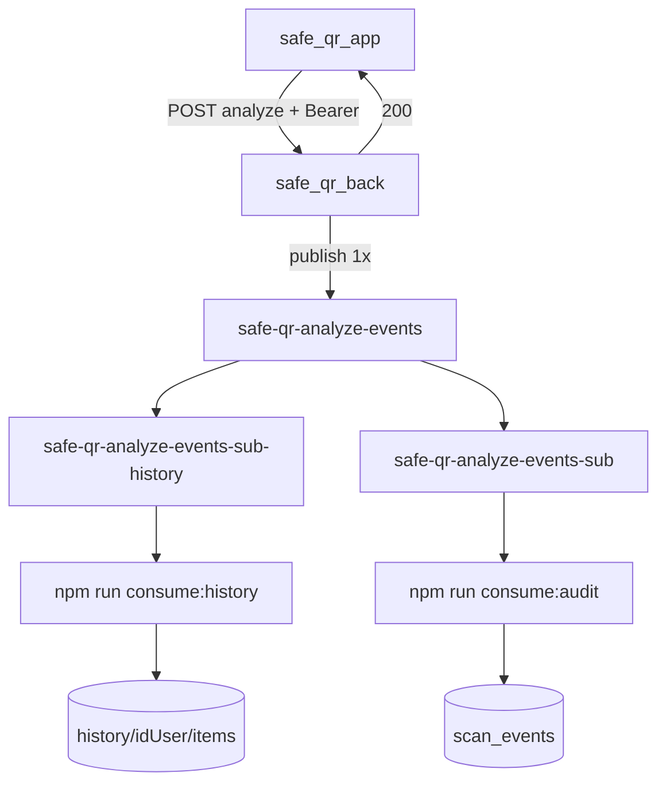

# 02 — Fan-out: consumidores histórico + auditoria

**Versão:** 1.0 · junho 2026  
**Status:** implementado

---

## Visão geral

Um **único publish** no tópico `safe-qr-analyze-events`. Duas **subscriptions** recebem cópia da mesma mensagem. Dois **processos** Node gravam destinos diferentes.



| Consumidor | Subscription | Firestore | Obrigatório pro app? |
|------------|--------------|-----------|----------------------|
| `consume:history` | `safe-qr-analyze-events-sub-history` | `history/{idUser}/items/{id}` | **Sim** (aba Histórico remoto) |
| `consume:audit` | `safe-qr-analyze-events-sub` | `scan_events/{eventId}` | Não (auditoria / PI) |

---

## Pré-requisito GCP

Criar a subscription de histórico (a de audit já existe):

1. Console → Pub/Sub → tópico `safe-qr-analyze-events`
2. **Criar assinatura** → ID: `safe-qr-analyze-events-sub-history`
3. Pull, ack 60s

```bash
gcloud pubsub subscriptions create safe-qr-analyze-events-sub-history \
  --topic=safe-qr-analyze-events \
  --ack-deadline=60
```

---

## `idUser` no evento

| Fonte | Uso |
|-------|-----|
| `Authorization: Bearer <Firebase JWT>` no analyze | **Obrigatório** — `decoded.uid` vira `data.idUser` |
| `client.idUser` no body | Metadado opcional — **não autentica** |

Sem `idUser` → `consume:history` ignora (warn `Evento sem idUser`).

Detalhes: [safe_qr_back/docs/13-pubsub-qr-analyzed.md](../../safe_qr_back/docs/13-pubsub-qr-analyzed.md)

---

## Campo `historyItem`

Presente em `data` quando há `idUser`. Usado só pelo consumidor de histórico.

```json
"historyItem": {
  "id": "MESMO_QUE_eventId",
  "type": "scan",
  "content": "https://example.com",
  "createdAtMs": 1717881330123,
  "verdict": "safe",
  "safeToOpen": true,
  "reasons": ["HTTPS OK"]
}
```

`content` = `rawContent` truncado em 2000 chars (montado no back ao publicar).

---

## Comandos locais

```bash
# Terminal 1 — histórico (obrigatório)
npm run consume:history

# Terminal 2 — auditoria (opcional)
npm run consume:audit
```

`.env` relevante:

```env
PUBSUB_SUBSCRIPTION_AUDIT=safe-qr-analyze-events-sub
PUBSUB_SUBSCRIPTION_HISTORY=safe-qr-analyze-events-sub-history
FIREBASE_GOOGLE_APPLICATION_CREDENTIALS=../safe_qr_back/safe-qr-app-....json
```

---

## Teste E2E

```bash
curl -X POST http://localhost:3000/v1/qr/analyze \
  -H "Content-Type: application/json" \
  -H "Authorization: Bearer test:firebaseUidTeste" \
  -d '{"rawContent":"https://example.com","client":{"platform":"android"}}'
```

Logs esperados:
- Back: `pubsub_qr_analyzed_published`
- History: `qr_analyzed_history_consumed` + `firestore.result: "created"`
- App: `GET /v1/history` com mesmo Bearer lista o item

---

## Troubleshooting

| Sintoma | Causa | Solução |
|---------|-------|---------|
| `Evento sem idUser` | Analyze sem Bearer válido | Enviar `Authorization: Bearer` |
| `Evento sem historyItem` | Mensagem antiga na fila | Purge ou aguardar novos eventos |
| `PERMISSION_DENIED` Firestore | SA sem `datastore.user` | IAM ou usar JSON Firebase do back |
| Histórico vazio no app | Worker `min: 0` ou parado | Cloud Run `min-instances=1`; ver [deploy-cloud-run.md](./deploy-cloud-run.md#troubleshooting) |
| Histórico vazio no app | `consume:history` local + nuvem | Parar consumidor local |

---

## Referências

- [01-PUBSUB-IMPLEMENTACAO.md](./01-PUBSUB-IMPLEMENTACAO.md) — setup GCP completo
- [../README.md](../README.md) — quick start
- [../../safe_qr_back/docs/12-api-historico.md](../../safe_qr_back/docs/12-api-historico.md) — CRUD histórico
