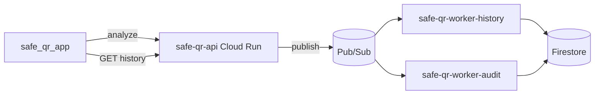

# Deploy consumidores no Cloud Run

## Produção (junho 2026 — validado E2E)

| Serviço | Revisão | Papel |
|---------|---------|-------|
| `safe-qr-worker-history` | `safe-qr-worker-history-00001-hm9` | Grava `history/{uid}/items` |
| `safe-qr-worker-audit` | `safe-qr-worker-audit-00001-b4v` | Grava `scan_events` |

Dois serviços a partir do **mesmo** `Dockerfile`, diferenciados por `CONSUMER_ROLE`:

| Serviço Cloud Run | `CONSUMER_ROLE` | Subscription | Firestore |
|-------------------|-----------------|--------------|-----------|
| `safe-qr-worker-history` | `history` | `safe-qr-analyze-events-sub-history` | `history/{uid}/items/{id}` |
| `safe-qr-worker-audit` | `audit` | `safe-qr-analyze-events-sub` | `scan_events/{eventId}` |

## Fluxo remoto completo (sem PC local)



## Deploy

```powershell
cd safe_qr_workers
npm run build
.\scripts\deploy-cloud-run.ps1
```

O script:

1. Cria `safe-qr-analyze-events-sub-history` se não existir
2. Faz deploy de **history** e **audit**
3. Configura `min-instances=1` + `--no-cpu-throttling` (consumidor pull 24/7)

### Por que `min-instances=1`?

Cloud Run escala por HTTP por padrão. Consumidores Pub/Sub precisam de processo **sempre ativo** escutando a subscription.

**Após o deploy, confira no Console** que o escalonamento mostra **mín. 1** (não 0). Se aparecer `min: 0`, o worker para de puxar mensagens e o histórico fica vazio:

```powershell
gcloud run services update safe-qr-worker-history `
  --region=southamerica-east1 --min-instances=1 --max-instances=1 --no-cpu-throttling
gcloud run services update safe-qr-worker-audit `
  --region=southamerica-east1 --min-instances=1 --max-instances=1 --no-cpu-throttling
```

## IAM (service account do worker)

Na conta usada pelos serviços (geralmente `214537528312-compute@developer.gserviceaccount.com`):

| Papel | Uso |
|-------|-----|
| `roles/pubsub.subscriber` | Pull das subscriptions |
| `roles/datastore.user` | Gravar Firestore |

Console: https://console.cloud.google.com/iam-admin/iam?project=safe-qr-app

## Variáveis (definidas pelo script)

| Variável | Valor |
|----------|-------|
| `CONSUMER_ROLE` | `history` ou `audit` |
| `GCP_PROJECT_ID` | `safe-qr-app` |
| `PUBSUB_SUBSCRIPTION_HISTORY` | `safe-qr-analyze-events-sub-history` |
| `PUBSUB_SUBSCRIPTION_AUDIT` | `safe-qr-analyze-events-sub` |
| `FIRESTORE_ENABLED` | `true` |
| `CONSUMER_ENABLED` | `true` |

Sem JSON no container — **ADC** da service account do Cloud Run.

## Verificar

1. Back publicando: log Cloud Run `safe-qr-api` → `pubsub_qr_analyzed_published`
2. Worker history: log `qr_analyzed_history_consumed` + `firestore.result: created`
3. App: scan → aba Histórico → pull-to-refresh
4. Firestore Console: `history/{uid}/items/...` e `scan_events/...`

## Desenvolvimento local (opcional)

```powershell
npm run consume:history   # terminal 1
npm run consume:audit     # terminal 2
```

**Não rode** `consume:history` / `consume:audit` localmente ao mesmo tempo que os workers na nuvem — competem pela mesma fila Pub/Sub.

## Troubleshooting

| Sintoma | Causa | Solução |
|---------|-------|---------|
| Scan OK, histórico vazio | Worker com `min: 0` | Forçar `min-instances=1` (comando acima) |
| Log worker para após deploy | Instância escalou a zero | Idem + `--no-cpu-throttling` |
| Mensagem nunca chega | Back sem `pubsub.publisher` | IAM na SA do `safe-qr-api` |
| Firestore vazio | SA sem `datastore.user` | IAM na SA dos workers |
| Duplicata / perda | Consumidor local + nuvem | Parar terminais locais |

Diagnóstico — mensagens na fila:

```powershell
gcloud pubsub subscriptions pull safe-qr-analyze-events-sub-history `
  --project=safe-qr-app --limit=3 --format=json
```

## Redeploy

```powershell
npm run build
.\scripts\deploy-cloud-run.ps1
```
